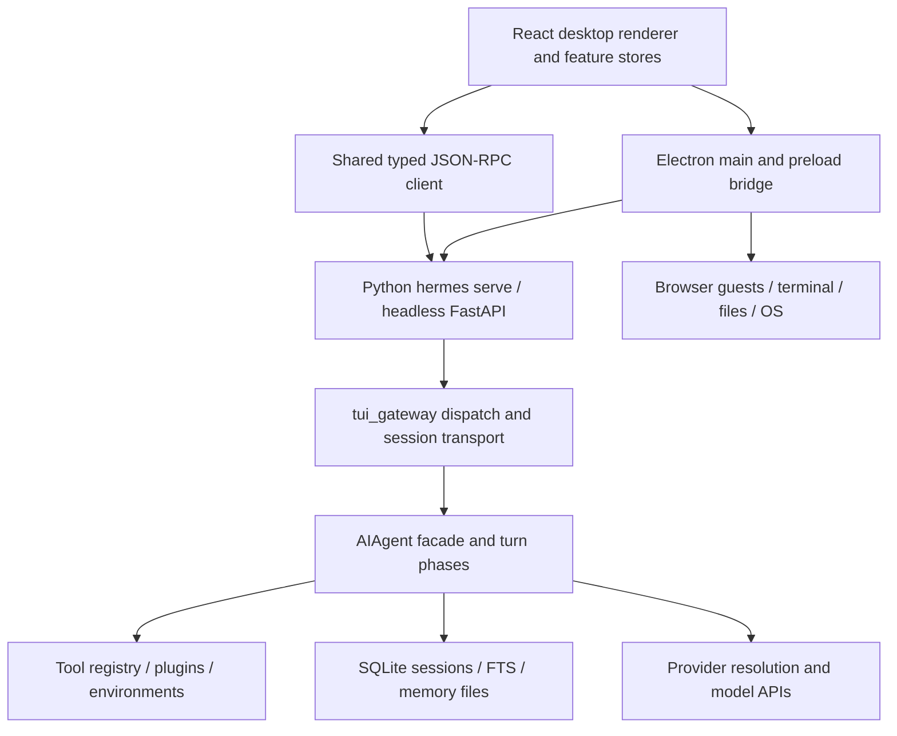
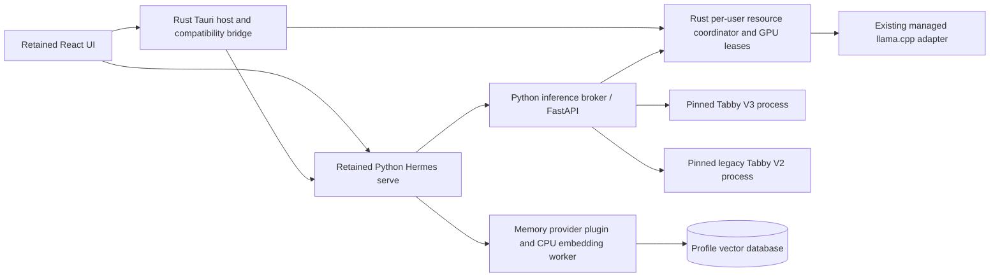
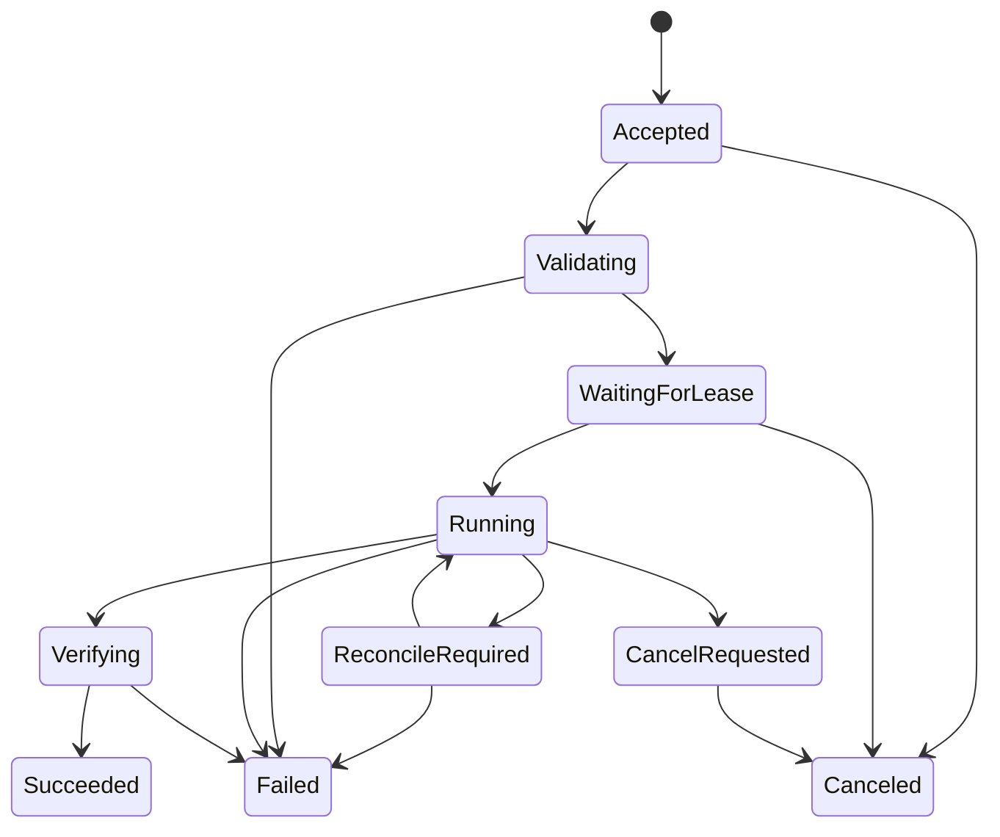
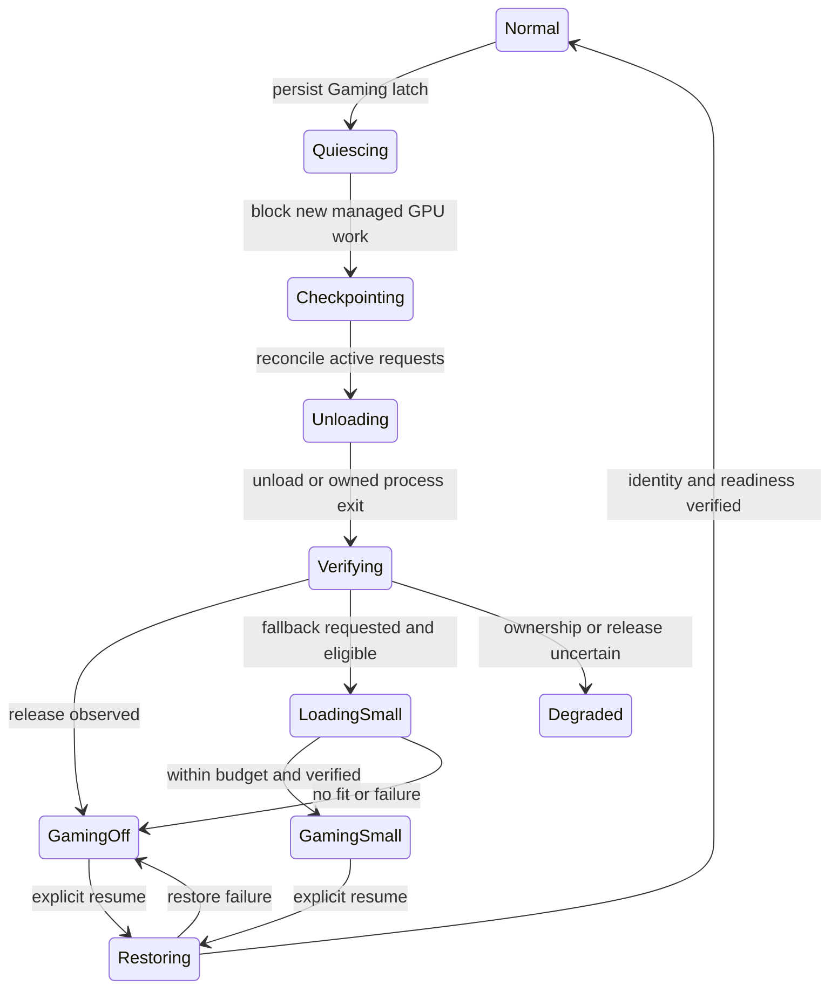

# Hermes Native Desktop: architecture specification and engineering roadmap

Research baseline: 7 October 2026. Target: Windows 11 x64. Status: reviewed architecture and implementation plan; application implementation remains future work.

## 1. Decision and scope

Build a Windows application with a Rust/Tauri 2 host, the retained Hermes React/TypeScript interface, the retained Python Hermes runtime, and a dedicated inference broker controlling separate TabbyAPI/ExLlamaV3 and legacy TabbyAPI/ExLlamaV2 processes. Add vector recall, saved model profiles and a Gaming Mode without replacing the agent loop or its existing tools.

The user accepted retaining the existing interface after discussing the tradeoff. Rust owns native Windows responsibilities; Python owns the agent, model orchestration and memory integration. TypeScript remains the presentation language. Tauri creates a native executable containing a webview application; it does not turn React into WinUI controls. A Python/Rust-only frontend rewrite is therefore outside the selected design.

This deliverable is a specification and implementation plan, not an implemented or benchmarked replacement application. “100% like Hermes Desktop” is a **release acceptance requirement for existing Windows behavior**, not a claim that source inspection proves a new binary has parity. Layouts, actions, shortcuts, stored data, streaming behavior and integrations are part of that requirement. Model-generated answer quality cannot be identical across different model weights or providers.

“TappyAPI” is interpreted as **TabbyAPI**, the ExLlama server at `theroyallab/tabbyAPI`. No alternate product was identified. Changing that assumption would require revalidating the inference adapter, not redesigning the agent and UI contracts.

The requested “without altering more than 85%” is retained as a ceiling on changed/replaced files in the frozen whole-application source boundary. A stronger proposed guardrail preserves **at least 85% of eligible existing agent and renderer source files unchanged**, while targeting 100% required behavior. Neither metric permits losing features or constitutes a measured implementation result. Section 16 defines both denominators, host replacement accounting and change review.

### 1.1 Required outcomes

| ID | Requirement | Design owner | Completion evidence for the future application |
|---|---|---|---|
| R01 | Preserve current Windows Hermes Desktop behavior and data | UI compatibility and runtime teams | Every baseline feature and contract row passes its parity scenario |
| R02 | Implementation-agnostic specification of the core | Architecture | Sections 4–6 define roles, invariants and transitions without relying on a framework |
| R03 | Python agent plus Rust/Tauri 2 Windows application | Runtime and shell | Installed signed application runs on a clean Windows 11 machine |
| R04 | Dedicated ExLlamaV3 and V2 sideloading | Inference | Certified EXL3 and EXL2 model packs load and complete a real tool cycle |
| R05 | SQLite or PostgreSQL vector memory | Memory | Scoped hybrid retrieval, provenance, delete and recovery tests pass |
| R06 | Manual inference, quantization and context profiles | Model Lab | Saved profiles reapply exactly; profiling results are reproducible; conversion creates a distinct artifact |
| R07 | Gaming Mode, evacuation, logical hibernation and smallest-model option | Resource controller | Admission closes immediately, owned VRAM is measured released, and restore preserves session semantics |
| R08 | Additional-feature review at approximately 75% of the document | Independent reviewer | Review reads sections 1–15 from the beginning; findings and dispositions are recorded in section 19 |
| R09 | Complete actionable engineering roadmap | Engineering | Sequenced work packages, dependencies, test gates, rollback and risk owners in sections 16–18 |

## 2. Evidence baseline and limitations

The inspected official source is `G:\Personal_Assistant\hermes\hermes-agent`, Git commit `649d6c0391029f35959cfbc240eb3534a6667cf5`. Its tracked working tree was clean at inspection. The installed desktop source is `apps/desktop`, not the small user-state directory `G:\Personal_Assistant\hermes\desktop`.

`G:\Personal_Assistant\hermes-webui` is a separate Python/vanilla-JavaScript browser interface at commit `48a2e79224c355ce40bc596e2165df0b558dc17e`. It is not the official Electron Desktop parity baseline. The official `web/` dashboard is a third presentation surface; its PTY-based chat must not be confused with the desktop’s React chat.

Read-only hardware inspection reported an NVIDIA GeForce RTX 5090, 32,607 MiB VRAM and driver 617.42. These facts support choosing a Windows/CUDA feasibility test; they do not certify any model, wheel, context size or evacuation time. No installed model was loaded, interrupted, benchmarked, migrated or unloaded during this research. User secrets, conversation content and database rows were not needed for analysis.

The local generated OpenRPC artifact contains 252 methods, 13 server requests and 77 notifications. The literal-channel scan of Electron preload finds 259 distinct channel names including `invoke`, `send`, `sendSync` and `on`. These are **static inventory counts**, not runtime coverage measurements. Dynamic dispatch, argument shapes, events, native guest preloads and observable error behavior need separate review.

Evidence classification used throughout:

- **Observed**: inspected source, generated contract or a read-only local command.
- **Upstream**: an official external source; pinned where a code-level claim depends on a version.
- **Proposed**: a target contract, threshold, schema or implementation decision in this plan.
- **Unverified**: a runtime claim that must be established in a named engineering spike or test.

Use [the evidence index](./EVIDENCE.md), [the baseline inventory](./baseline-inventory.json) and [the source manifest](./source-manifest.json) to resolve code anchors and hashes. The local source wins over stale comments and current website descriptions when defining the installed baseline. Future implementation must pin this baseline, then review upstream changes explicitly.

## 3. Reverse-engineered current architecture

### 3.1 Process and responsibility map



The desktop host discovers or launches the Python backend, resolves profile-specific connections and exposes native capabilities. The renderer manages the visible state and commands. The shared client handles the backend wire contract. `hermes serve` exposes a headless backend independently of the dashboard frontend. The TUI and desktop share gateway behavior without sharing the same screen implementation. [L01–L04](./EVIDENCE.md#l01)

Python owns sessions, prompts, tool execution, provider resolution, approvals, memory and persistence. `AIAgent` is a facade assembled from topic-specific mixins; the conversation loop delegates to turn-phase modules. Session persistence uses an analogous facade/sibling layout. This permits targeted replacement at boundaries without reimplementing the whole agent. [L05–L08](./EVIDENCE.md#l05)

### 3.2 The useful design patterns

| Pattern | Observed realization | Rule to carry into the replacement |
|---|---|---|
| Thin client, authoritative service | Desktop renderer sends gateway commands | Never put agent/tool policy in a UI component |
| Ports and adapters | Providers, memory plugins, tool environments and platform adapters | Add inference and memory adapters behind stable contracts |
| Facade with topic modules | `run_agent.py`, `hermes_state.py`, gateway and CLI siblings | Keep public entry points stable; avoid an unrelated core rewrite |
| Typed bidirectional RPC | Python contracts generate TypeScript/OpenRPC | Preserve requests, responses, server questions and notifications, not just endpoints |
| Feature-owned observable state | Nanostores and feature action modules | Reuse renderer state ownership and subscription cleanup |
| Session-scoped execution | Turn leases and explicit profile context | Carry owner identity across callbacks, threads and child processes |
| Stable prompt prefix | Memory/tool/system context is not arbitrarily rebuilt mid-session | Add recall without mutating historical prompt blocks |
| Durable history with live projections | SQLite state plus replay and session snapshots | Treat notifications as a transport view, not the only record of truth |
| Narrow core, extension at boundaries | Plugins and skills supply capabilities | Implement vector memory as a provider and model control as an adapter |
| Supervised auxiliary processes | Backend pool, local model server and subprocess tools | Track process ownership and lifecycle explicitly |

### 3.3 Existing Local Models functionality

The inspected desktop already has a Local Models settings pane, hardware/catalog views, downloads, runtime installation, job status, sideloading and model selection. `electron/feature-flags.ts` enables the surface on Windows. Older comments describing it as exclusively a launch-flag feature are stale. [L09](./EVIDENCE.md#l09)

The implementation is oriented to managed **llama.cpp/GGUF**. Current sideloading accepts a `.gguf` file. Activation assigns the model for new chats and does not itself necessarily load it. Ejection unloads now but permits future demand loading. Stopping the local server also disables its automatic start. Its host-wide server is distinct from profile-scoped default choices. [L10](./EVIDENCE.md#l10)

Consequently, reuse the pane, job components and status patterns, but do not silently reinterpret its existing commands. ExLlama registration is directory/artifact based, requires a new engine descriptor, and needs explicit load/reload semantics. Gaming Mode must suppress demand loading; calling the existing eject command is insufficient.

### 3.4 The substantial native boundary

The Electron preload exports a broad `window.hermesDesktop` bridge for connections, backend pools, files, Git, previews, browser guests, terminal sessions, clipboard, screenshots, voice permissions, windows, quick entry/HUD, notifications, pets, updates, secrets and plugins. This is not a small “replace the window launcher” migration. [L02](./EVIDENCE.md#l02)

The preview pane directly creates an Electron `<webview>` with a persistent partition. It uses guest JavaScript execution, input events, navigation, developer tools, webContents identity and lifecycle events. These behaviors require an explicit native browser adapter under Tauri. Preserve the guest’s security boundary and profile partitioning, not Electron-specific method names at any cost. [L11](./EVIDENCE.md#l11)

## 4. Implementation-agnostic domain specification

This section defines what the system does independent of Python, Rust, Electron, Tauri, HTTP or a database engine. The selected technology mapping begins in section 7.

### 4.1 Domain entities

| Entity | Identity and important state | Authority |
|---|---|---|
| User profile | Stable ID, home scope, preferences, allowed resources, credential references | Profile service |
| Workspace/project | Canonical path or remote identity, project metadata, scoped instructions | Workspace service |
| Conversation | Stable persisted identity, lineage/branch, profile, workspace, ordered messages | Conversation store |
| Live session | Connection attachment, transport generation, current turn, open questions | Session runtime |
| Turn | Input, immutable configuration snapshot, budget, status, tool-call records | Agent runner |
| Message | Stable identity, role, content parts, tool/reasoning/usage metadata | Conversation store |
| Tool invocation | Call identity, input, authority, approval, execution state, outcome | Tool executor |
| User request | Correlation identity, owning turn/session, deadline, response/cancellation | Request broker |
| Model artifact | Content/manifest identity, format, tokenizer, architecture, source and license metadata | Model catalog |
| Model profile | Immutable revision of load and generation settings for an artifact/runtime | Profile registry |
| Runtime instance | Engine version, process identity, actual model identity, resource lease, health | Resource supervisor |
| Memory item | Source identity, scope, provenance, content hash, lifecycle and retention | Memory service |
| Derived vector | Memory/chunk ID, embedding revision/dimension, embedding data, index generation | Retrieval index |
| Operation | Durable desired action, idempotency key, phase, timestamps, cancellation and result | Operation controller |

Do not confuse a Hermes user profile, a live RPC session and a saved model profile. They have different lifetimes and authorization scopes. A conversation may survive several connections and runtime restarts; a GPU allocation must not become its identity.

### 4.2 Core invariants

1. Every action is attributed to an authenticated connection, profile and, where relevant, session/workspace. Unbound background work fails closed rather than using another profile’s defaults.
2. One logical turn owns a conversation’s mutation lease. Parallel conversations may run, but cannot silently interleave mutations into one turn.
3. A tool call has a stable identity and exactly one recorded terminal outcome. An interrupted or uncertain external side effect is not automatically repeated after restart.
4. The agent’s prompt prefix and tool schema snapshot remain stable during a conversation except an explicit, recorded context-compaction or session-transition path.
5. Current state can be reconstructed without trusting that every UI notification arrived. Reconnect reconciles history, open requests and replay cursors.
6. UI cancellation, inference cancellation and tool cancellation are separate operations. Each reports its actual scope and outcome.
7. Secrets remain outside code/configuration files. Services receive allowed values through scoped environment variables; the renderer receives references/status, not inference admin credentials.
8. No model request is admitted against an engine whose actual artifact, profile revision or resource lease differs from the request snapshot.
9. At most one managed inference owner holds a GPU-set lease by default. Any future co-residency mode requires a measured reservation policy and separate approval in the design.
10. Gaming Mode is an authoritative policy latch. Scheduler activity, embeddings, profile changes, plugins and automatic warmup cannot bypass it.
11. Source memories and conversation records outlive rebuildable vector indexes. Losing an index must not erase canonical history.
12. A feature visible and supported in the baseline is not removed merely because the replacement host lacks a ready-made API.

### 4.3 Stable use cases

**Send a prompt:** resolve profile/workspace → acquire turn authority → snapshot routing/configuration → validate attachments → assemble context → admit inference → stream results → execute approved tools as requested → repeat within budget → persist final or interrupted outcome → release authority → trigger permitted post-turn work.

**Reconnect:** authenticate → resolve conversation lineage → restore a live session or open history → reconcile event cursor and gaps → restore still-open user requests → project current state. Reconnection cannot manufacture duplicate turns or silently approve a previously unanswered request.

**Change a model/profile:** save a draft profile → validate compatibility → choose the applicable session boundary → quiesce affected inference leases → load the selected revision → verify actual engine state → commit selection. If verification fails, retain the prior known configuration or report an unloaded state; never label a failed new selection as active.

**Recall memory:** establish retrieval scope → compute/query an embedding with a fixed embedding version → combine keyword and vector candidates → enforce source visibility/deletion filters → rank and deduplicate → return bounded excerpts with provenance. Failure to retrieve may degrade to keyword search, but must remain visible in diagnostics.

**Enter Gaming Mode:** persist policy → close admission → reconcile in-flight inference and tools → checkpoint logical state → unload managed GPU allocations → verify release → optionally load a certified small model within the game budget → expose the actual achieved state.

## 5. Functional parity contract

The following are mandatory feature families, including failure, cancellation, keyboard and multi-window behavior. Fine-grained native and RPC inventories accompany this document; this table is a readable grouping, not a replacement for those inventories.

| Parity family | Preserve | Migration seam | Required scenario |
|---|---|---|---|
| Chat and composer | Streaming text/reasoning, tool cards, rich content, attachments, paste, queues, slash commands, context/usage | Existing components and gateway client | Send text/image/file, run a tool, interrupt, redirect and reconnect |
| Conversation management | List/search, title, archive, delete, resume, branch, undo, hidden/active states and lineage | Existing session RPC and store | Branch after tool result; restart; verify histories remain distinct |
| Workspaces and projects | Local/remote identity, browsing, previews, moves and Git operations | Native host adapter plus existing APIs | Open a workspace with spaces/Unicode and review a diff |
| User profiles and connections | Isolation, local/remote routing, backend pools, SSH and cloud surfaces where supported | Rust connection/supervisor adapter | Two profiles with same session labels do not share secrets or model defaults |
| Tools, skills and plugins | Discovery/configuration, tools and approvals, MCP, skill commands, desktop plugin contributions | Retained Python/plugin protocols and UI bridge | Install a test plugin in an isolated home and exercise its settings and question flow |
| Browser and previews | Persistent partitions, navigation, downloads/popouts, capture, automation bridges, safe external links | Dedicated WebView2 browser adapter | Authenticated guest browsing and capture without privileged bridge leakage |
| Terminal and processes | Interactive terminal, resize, input, lifecycle, task output and external terminal opening | ConPTY/native process adapter | Interactive Windows command survives resize and terminates only its own child |
| OS integration | Tray, notifications/actions, deep links, shortcuts, quick entry/HUD, clipboard, screenshots, power events | Tauri/native commands | Close to tray, summon composer, deliver notification, resume after sleep |
| Audio/voice and accessibility | Permission prompts, recording/playback, configured providers, focus and keyboard traversal | Retained UI + media/native adapters | Denied mic permission and screen-reader navigation recover coherently |
| Scheduled/background work | Cron, subagents, Kanban/tasks, bot/remote modes and wake behavior | Existing gateway/runtime | Background task remains correct with desktop minimized and Gaming Mode enabled |
| Settings and visual identity | Themes, skins, locale, layout, font/zoom, settings persistence | Existing renderer plus settings adapter | Compare screenshots at common DPI settings and reopen settings |
| Local and remote models | Existing llama.cpp/GGUF and remote provider workflows alongside new ExLlama | Engine adapter registry | Existing model selection still works after installing V3/V2 runtime packs |
| Lifecycle and distribution | Onboarding, repair, diagnostics, updates, restart and uninstall data retention | Rust lifecycle + installer | Upgrade and rollback on a clean Windows user account |

Capture actual baseline screenshots and interaction recordings during milestone M0. Source inspection establishes the inventory; it does not replace visual comparison with the installed build. Keep baseline capability availability (OS, account and provider requirements) attached to each case. Windows-inapplicable macOS-only behavior is recorded as such, never counted as a silently passing Windows test.

## 6. Protocol, session and persistence specification

### 6.1 Preserve the existing wire before adding new APIs

Reuse `apps/shared` and the Python-generated gateway contracts. The [complete pinned OpenRPC snapshot](./contracts/gateway-baseline.openrpc.json) accompanies this plan so existing wire shapes are available independently of the installed checkout. A replacement host must carry bidirectional JSON-RPC requests, correlated responses and asynchronous notifications. Approval, clarification, secrets/sudo, vault and desktop bridge questions are server requests with response identities; they cannot be replaced by fire-and-forget toast events. Missing fields and explicit nulls retain their existing meanings. [L03, L04](./EVIDENCE.md#l03)

Preserve the installed handler error semantics. The actual contract validator rejects unknown parameter keys immediately, while some missing/type failures retain the handler’s existing domain error. Do not impose a generic schema error on every existing method and accidentally change clients. Generate new extension contracts from one source of truth; test generated TypeScript/OpenRPC freshness.

Each UI operation captures its connection/profile route at submission. Subsequent callbacks use that captured owner even when the user switches the foreground profile. Subscription disposal is part of the contract: closing a pane or moving a session must not leak handlers or duplicate events.

### 6.2 Reconnect and cancellation

The existing event replay is a bounded in-memory ring, with sequence numbers and a process epoch. The inspected defaults include 512 events per session, 64 replay sessions and byte caps. `session.events.since` reports truncation and open requests. This is not an unlimited durable event log. [L07](./EVIDENCE.md#l07)

The retained client must:

1. Remember the last accepted sequence for each live route/session and deduplicate replayed frames.
2. Hold live frames while applying the requested replay, then merge in order.
3. Reset sequence assumptions when the backend epoch changes.
4. Refetch canonical history/current state after truncation or restart.
5. Independently restore unanswered server requests and withdraw canceled ones.

Closing a UI window does not necessarily cancel its agent. A user interrupt stops the applicable turn according to the existing runtime. Gaming Mode adds an inference admission barrier but must not falsely claim to cancel external tools that are already executing. On crash recovery, a pending external side effect becomes an explicit uncertain state until reconciled.

### 6.3 Data ownership

The observed Hermes database schema version is 31. Core data includes system-prompt deduplication, sessions and lineage, messages with `api_content` and display metadata, usage, routing, durable generations, turn leases, compression locks and delegation state. SQLite FTS5 supplies lexical search; it is not a vector index. [L06](./EVIDENCE.md#l06)

Do not migrate canonical Hermes storage to PostgreSQL as a prerequisite for vector memory. Keep existing profile directories, database formats and built-in `MEMORY.md`/`USER.md` behavior. New model and vector state live in separate, versioned stores. Preserve serialized transcript writes and the existing WAL/read-pool behavior; never hold a history transaction while embedding text or loading a GPU model.

Proposed stores:

| Store | Scope | Contents | Recovery |
|---|---|---|---|
| Existing Hermes state and memory | Existing profile | Conversations, settings, canonical memory and agent data | Existing supported snapshot/migration mechanisms |
| `native-models.db` | Local application user/host | Artifact registrations, immutable model profiles, operation journal, measurements | Transactional backup and schema migration |
| `vector-memory.db` | Hermes profile | Memory provenance, chunks, tombstones, ingestion outbox and vector index generation | Rebuild embeddings/index from permitted source records |
| Resource policy record | Local application user/host | Gaming latch, desired mode, previous verified model/profile | Small atomic durable write; reconcile before admitting work |
| Runtime pack manifest | Installed application/runtime version | Executable/library hashes, ABI, engine capabilities, probe status | Replace whole pack atomically; keep last known-good pack |

Use short database transactions and a single writer queue for each new SQLite store. Copying a live `.db` file without coordinating WAL is not a backup. Use the SQLite backup API or the baseline’s tested backup procedure. Index work has its own durable outbox and does not hold the transcript writer lock.

## 7. Selected Python and Rust architecture



### 7.1 Ownership and process boundaries

| Component | Implementation | Owns | Must not own |
|---|---|---|---|
| Presentation | Retained React/TypeScript, feature stores | Layout, transient interaction, projections | Agent policy, privileged execution or admin keys |
| Desktop host | Rust/Tauri 2 | Native APIs, desktop-owned serve jobs, connection routing, installer UI, coordinator client | Agent loop or independent GPU authority |
| Resource coordinator | Separate Rust per-user daemon | Persistent latch, GPU leases, broker and GPU/speech/conversion jobs, background-client lifetimes | Conversation logic or unrelated users/processes |
| Hermes service | Existing pinned Python payload | Agent sessions, tools, credentials/profile scope, persistence, gateway contracts | CUDA engine imports |
| Inference broker | Dedicated Python/FastAPI service | Request admission, model identity, profile validation, engine adapters, operation journal | Arbitrary renderer-supplied shell execution |
| V3 and V2 engines | Separate pinned Python environments/processes | Their loaded weights, KV cache and generation | Shared mutable environment or hidden model switching |
| Memory integration | Standalone Python memory-provider plugin | Lifecycle hooks, ingestion, bounded recall and provenance | Modifying historical system prompts |
| Embedding worker | CPU by default; separate process when needed | Embedding batches and versioned output | Uncontrolled GPU residency |

One Rust resource coordinator decides policy and GPU leases. It is an application-owned per-user daemon with a lifetime independent of the visible Tauri window. A Windows named mutex keyed to the user SID and an authenticated named pipe enforce one coordinator for this application's managed workloads on this machine. A second app instance attaches or fails safely; it cannot start a competing GPU owner. Other applications and other Windows users remain external resource consumers.

The broker performs inference sequencing and consults that coordinator; it is not a competing independent scheduler. Every lease/load/restore commit rechecks the coordinator generation and current latch immediately before opening admission. If authority is lost, the broker fails closed, cancels/quiesces existing managed GPU work according to its owned-worker policy and reports recovery; it does not independently switch to Normal. Persisted policy, verified process creation identities and authenticated reconnect determine recovery.

The coordinator owns inference, speech and conversion worker Job Objects, not the Tauri window. While an explicitly detached gateway holds a registered background client lease, the broker/coordinator remain available after the last desktop window fully exits. Desktop-owned `serve` processes still stop with the desktop. With no desktop or background clients, the coordinator drains and exits under the configured idle policy. An on-demand launcher for an authorized gateway can reconnect/start the signed coordinator without changing the Gaming latch. This preserves local inference for the detached gateway rather than silently restricting it to remote providers. No new privileged Windows service is required.

Model APIs exposed to Hermes are stable even when the selected engine process changes. A coordinator crash closes its owned-worker jobs; neither the agent nor the detached gateway is in those jobs. Upon restart, reopen GPU admission only after latch and worker reconciliation.

Do not require the Python version used by Hermes to match the GPU runtime. The installed project has Python-version-specific dependencies and its own package manager. V3/V2 extension wheels have stricter Python/Torch/CUDA ABI combinations. Package these as independent payloads rather than downgrading the agent or adding CUDA dependencies to its environment.

### 7.2 Native host compatibility layer

First implement a typed adapter preserving the public `hermesDesktop` interface and event shapes. During migration, the existing renderer can bind that interface to either Electron or Tauri in a development comparison harness. New code calls a host-neutral interface. Remove direct Electron guest calls through a small browser capability interface, not an application-wide component rewrite.

Classify bridge entries as startup snapshots, asynchronous commands, subscriptions, synchronous getters and transferred native identities. The existing preload synchronously supplies feature flags, skin, translucency and HUD windowing before first paint. Construct a trusted immutable bootstrap snapshot before React mounts, or hold a bootstrap barrier until it is ready. Do not change existing synchronous property reads into promises across the UI. Supply dynamic changes through events, and repeat this initialization for HUD, quick-entry and pet windows. [L02](./EVIDENCE.md#l02)

Proposed Rust modules:

```text
desktop-host/
  bridge/          typed commands, events, route capture, subscriptions
  backends/        serve discovery, ready parsing, pooling, re-home
  windows/         main window, peers, tray, HUD, quick entry, pets
  browser/         guest controls, partitions, navigation, capture
  terminal/        ConPTY lifecycle and xterm transport
  workspace/       local files, Git adapter, watches, remote routing
  resource/        authenticated coordinator client and UI status
  credentials/     OS credential access and scoped environment injection
  distribution/    updater, rollback, runtime pack verification
resource-coordinator/
  authority/       per-user singleton, leases, fencing, background clients
  workers/         inference/speech/conversion jobs and verified ownership
  policy/          durable Gaming latch and resource reconciliation
```

Use Rust typed errors (`thiserror` or equivalent), bounded channels, Tokio for I/O and cancellation, and blocking workers for OS calls that cannot be asynchronous. Never block the WebView/UI event loop on model loading. Avoid broad unsafe FFI; document and test unavoidable Win32 ownership/lifetime boundaries.

### 7.3 Python service practices

Use explicit service lifespans, Pydantic contracts and dependency injection for the new broker. Keep its management API and inference API logically separate. The existing agent loop is synchronous; run it through its existing worker model, not directly inside a FastAPI event loop. CPU embedding, conversion and blocking driver queries use bounded worker processes/threads, not unbounded `BackgroundTasks` work.

Use Python’s built-in `logging` module with `INFO`, `WARNING` and `ERROR`, request/operation IDs, and secret redaction. Log lifecycle facts and durations without prompts, key values or full user paths by default. Report one actionable exception chain rather than leaking raw environments. Rust tracing should share correlation IDs with Python logs.

## 8. Inference compatibility and runtime packs

### 8.1 Verified upstream split

| Runtime pack | Inspected pin | Scope and limitation |
|---|---|---|
| `tabby-v3` | TabbyAPI `2fd6cc76203a66e13042daf7d76e5898b21c1ad8` | Current main rejects `exllamav2`; its supported pack targets V3 |
| `tabby-v2-legacy` | TabbyAPI `79126f904c2e00aece026b36bb70bbb87e4892b2` (`exl2-checkpoint`) | Candidate frozen legacy runtime retaining V2; certify independently |
| V3 dependency family | Current Tabby pins ExLlamaV3 1.5.4 with Torch 2.9.0/CUDA 12.8 Windows wheel family | Windows CPython 3.10–3.13 wheels are upstream evidence, not a local validation result |
| V2 dependency family | Legacy branch pins ExLlamaV2 0.3.2 in the corresponding Torch/CUDA family | Archived upstream compatibility tier; maintenance and security patches remain our responsibility |

[U01–U06](./EVIDENCE.md#u01) record exact code and dependency references. Choose a single certified Python ABI per pack after Windows tests; Python 3.12 is a candidate, not a forced change to the installed Hermes environment. Pin the complete transitive lock and wheel hashes, including required Windows Triton components where applicable.

| Artifact | Target engine | Admission rule |
|---|---|---|
| EXL3 | V3 | Supported architecture, quantization metadata, tokenizer/template and all shards verified |
| EXL2 | V2 legacy | Compatible V2 architecture and checkpoint format verified |
| Supported GPTQ | V2 legacy | Only the formats/architectures validated for the pinned engine; no blanket “all GPTQ” claim |
| HF unquantized weights | Conversion job or supported engine input only | Do not relabel as EXL3; conversion and inference support are separate |
| GGUF | Existing llama.cpp adapter | Preserve existing behavior; not passed into ExLlama |

### 8.2 Sideload/import transaction

1. Select an existing directory through the native picker; support spaces, Unicode and long paths.
2. Read only data manifests/configuration, tokenizer/template files and weight headers. Do not execute model-supplied Python or enable remote code by default.
3. Resolve canonical paths and reject traversal, unexpected reparse targets outside granted roots, incomplete shards and conflicting formats. Record whether the registration references or copies the original artifact.
4. Compute a stable artifact identity from manifest, tokenizer/template and weight metadata; perform full content hashing as a cancellable job where needed. A partially verified artifact is not a trusted ready artifact.
5. Match format plus architecture to a certified runtime pack. Show a specific incompatibility reason before attempting allocation.
6. Create catalog metadata and a default profile draft. Do not load a multi-gigabyte model merely to register it.
7. Run explicit validation/load as a managed operation; commit ready state only after identity and inference checks.

An immutable catalog identity does not make an externally referenced directory immutable. Revalidate weights, configuration, tokenizer and template fingerprints before load, restore and conversion. A changed component invalidates prior measurements, Gaming eligibility and profile certification; create a new artifact revision and require validation rather than silently reusing the old ID. Offer an app-managed content-addressed copy for stronger integrity. File watches are hints, not a substitute for admission-time validation.

Deleting a catalog registration must not delete the original sideloaded folder. A separate user-initiated delete of app-managed copies must identify exactly which bytes it removes. Preserve source provenance and model license metadata without embedding credentials in download URLs.

### 8.3 Upstream control contract that the adapter must respect

| Upstream endpoint | Meaning | Adapter obligation |
|---|---|---|
| `GET /health` | Process liveness | Never interpret as “correct model is ready” |
| `GET /v1/models`, `/v1/model/list` | Catalog/discovery | Normalize without claiming residency |
| `GET /v1/model`, `GET /props` | Actual loaded identity/context and properties | Confirm against the lease before opening admission |
| `POST /v1/model/load` | Admin load with SSE progress | Persist operation identity; reconnect/reconcile rather than retry blindly |
| `POST /v1/model/unload` | Admin unload of current model, cancels active inference | Quiesce first; request success alone does not prove VRAM release |
| `POST /v1/model/embedding/unload` | Separate embedding container unload | Include when owned GPU embeddings exist |
| `POST /v1/chat/completions` | Chat Completions with optional stream and tools | Validate model/template/tool parser behavior |
| `POST /v1/token/encode`, `/decode` | Tokenizer operations | Use the selected tokenizer for exact context checks |

These paths describe the inspected current V3 server. The legacy adapter must be separately contract-tested; it may not inherit every V3 field or semantic. [U07–U09](./EVIDENCE.md#u07)

Several source details are load-bearing:

- The current chat request’s `model` field does not choose a model; the loaded model is used. The broker must enforce actual model identity.
- A same-path load may report completion without applying new load settings. Changed context/cache/placement requires an explicit unload/reload transaction.
- A disconnected load-progress SSE client does not cancel loading. Inspect the same operation/runtime before retrying or spawning anything.
- Unknown load keys can be ignored upstream. Reject unsupported profile fields in our adapter rather than showing them as applied.
- API route existence is not capability proof. Current V3 LoRA methods include stubs; leave unsupported controls disabled with a reason.
- Chat Completions compatibility does not establish an OpenAI Responses API implementation.

## 9. Inference broker and application API contracts

### 9.1 Stable model identity and scheduling

Expose one stable local Chat Completions base URL to Hermes through the existing custom provider path. Use a model alias that resolves to an immutable artifact/profile revision. The broker authenticates and resolves owner scope before admitting a request. A shared upstream API key alone is not sufficient to distinguish multiple Hermes profiles; the provider adapter uses profile-bound scoped credentials or a signed internal context, never a client-supplied untrusted header.

Lease identity is `(host_id, gpu_set, runtime_pack_id, runtime_generation, artifact_id, load_profile_revision)`. A generation stream holds a lease for its lifetime. A load/switch transaction acquires an exclusive transition lease and waits for, or explicitly cancels, existing streams according to policy. Cross-profile requests queue fairly or receive a recoverable busy response; they never silently run on the currently resident wrong model.

The default supports one resident inference model per GPU set. Multiple live conversations can time-share the same certified configuration. Scheduling must account for KV/batch capacity; multiple HTTP connections do not prove capacity for unlimited concurrent contexts. Auxiliary requests (title, summarization, vision, skill extraction), cron, subagents and benchmarks pass the same admission policy when routed to managed local inference.

### 9.2 Proposed extension API

These are **new proposed broker endpoints**, not existing Hermes or Tabby routes. The desktop’s existing API proxy routes them to the correct local machine. Keep `/api/local-models/*` behavior backward compatible; its engine adapter dispatch may share internal services with the new endpoints.

| Method and route | Input | Result and effect |
|---|---|---|
| `GET /api/native/v1/capabilities` | Host scope | Pack versions, features and reasons for disabled capabilities |
| `GET /api/native/v1/models` | Scope/filter/cursor | Artifact catalog and measured residency, separately |
| `POST /api/native/v1/models/register` | Granted path handle, copy/reference mode | Operation ID; validate and register, no implicit load |
| `POST /api/native/v1/model-profiles` | Artifact ID, typed settings | Immutable revision; validation errors with field paths |
| `POST /api/native/v1/model-profiles/{id}/apply` | Revision, expected active generation, transition policy | Operation ID; explicit reload if required |
| `POST /api/native/v1/profiling-runs` | Profile revision, named workload and seed | Operation ID; exclusive measured run |
| `POST /api/native/v1/quantization-jobs` | Immutable source, output grant, engine, bitrate/calibration config | Operation ID; distinct output artifact on success |
| `POST /api/native/v1/resource-mode` | `normal`, `gaming_off` or `gaming_small`; game budget | Operation ID; authoritative host policy |
| `GET /api/native/v1/operations/{id}` | Authorized operation ID | Durable desired state plus observed state, phases and error |
| `POST /api/native/v1/operations/{id}/cancel` | Expected operation revision | Cancellation request; may return pending, not false completion |
| `GET /api/native/v1/operations/{id}/events` | Replay cursor | Progress SSE; reconcile through GET after a gap |
| `GET /api/native/v1/memory/status` | Profile | Index generation, queue depth, provider and embedding health |
| `POST /api/native/v1/memory/search` | Query, authorized scope, bounded k | Cited ranked excerpts and retrieval diagnostics |
| `POST /api/native/v1/memory/reindex` | Expected generation and embedding revision | Resumable operation; old index remains active until validated |
| `POST /api/native/v1/memory/items/{id}/forget` | Scope and expected revision | Tombstone acknowledged before asynchronous vector cleanup |

Every mutating operation accepts an idempotency key and expected revision where races matter. Store `(scope, key, request_hash, operation_id)` atomically; a repeated key with a different payload returns a conflict. Operation IDs do not confer authorization. Use stable machine-readable errors such as `INCOMPATIBLE_ARTIFACT`, `GPU_BUDGET_EXCEEDED`, `PROFILE_RELOAD_REQUIRED`, `GAMING_MODE_ACTIVE`, `STALE_REVISION`, `ENGINE_UNAVAILABLE` and `OPERATION_UNCERTAIN`, with field detail and actionable UI text.

### 9.3 Operation state machine



Persist transitions before reporting them. “Accepted” is not “applied”; “cancel requested” is not “canceled”; an observation-channel timeout is not process termination. Use capped retry/backoff and explicit reconciliation deadlines. Never retry a model load by creating a second GPU owner.

## 10. Vector memory specification

### 10.1 Integration and storage choice

Implement an out-of-tree `local_vector` MemoryProvider plugin. Retain native memory files and the existing memory tool. Hermes permits one external provider alongside built-in memory; SQLite and PostgreSQL are storage choices inside this one provider, not two simultaneously registered external providers. If the user already selected Honcho or another external provider, switching to `local_vector` is explicit; do not silently disable it or invent multi-provider composition. [L08](./EVIDENCE.md#l08)

Default to a profile-scoped SQLite database with a pinned `sqlite-vec` extension and CPU embeddings. SQLite by itself is not a vector engine. Use FTS plus vector search for hybrid retrieval. PostgreSQL with pgvector is an alternative when a shared/server deployment justifies running and backing up a database service. Keep the repository interface identical and test both only when shipping both; SQLite is the first release acceptance target. [U15, U16](./EVIDENCE.md#u15)

Use separate vector index generations for embedding model/revision/dimension changes. Never compare vectors from incompatible embedding spaces. Start with exact filtered search for modest local corpora; adopt an approximate index only after measured scale requires it. Filter by owner/profile before ranking; do not retrieve another profile’s neighbors and merely remove them in the UI.

### 10.2 Proposed logical schema

| Table/entity | Important fields and constraints |
|---|---|
| `memory_sources` | `source_id`, profile, kind, session/message lineage, revision, canonical locator, content hash, retention policy, deletion generation |
| `memory_items` | `item_id`, source FK, text/fact, provenance span, author/trust label, valid-from/to, tombstone, revision |
| `memory_chunks` | `chunk_id`, item FK, stable ordinal/span, content hash, extraction version, token count |
| `embedding_versions` | Model ID/revision, tokenizer/preprocess version, dimension, metric, normalization, runtime fingerprint |
| `chunk_vectors` | Chunk FK, embedding version, index generation, vector; unique `(chunk_id, embedding_version, generation)` |
| `ingestion_outbox` | Source/revision, action, dedup key, attempts, next attempt, last error; unique deterministic event key |
| `retrieval_audit` | Request/turn ID, item IDs, rank/score components, selected token budget, index generation; no secret content by default |
| `index_generations` | Building/ready/active/retired state, counts/checksum, source high-watermark and schema version |

Canonical keys are independent of physical SQLite row IDs or PostgreSQL vector indexes. Keep tombstones authoritative even if a worker holding an old chunk finishes late. A transaction checks source revision and deletion generation before accepting that worker’s output.

### 10.3 Ingestion and retrieval lifecycle

1. Mirror successful built-in add/replace/remove through `on_memory_write`, retaining previous-content identity to resolve replacement/deletion. Ingest authorized completed conversation content through provider sync hooks; ingestion scope and retention are user-controlled.
2. Write source metadata plus an outbox event in one transaction. This guarantees durable indexing work for data **accepted by the provider**. It does not make the earlier Hermes canonical write and later plugin callback atomic across databases.
3. A bounded CPU worker normalizes/chunks content and embeds it with the pinned embedding version. Use idempotent upserts and source-revision checks.
4. `prefetch(query, session_id=...)` does bounded retrieval once at the normal turn boundary. Combine lexical/vector candidates using reciprocal rank fusion or a measured equivalent, deduplicate, apply scope/tombstones, and fit a tokenizer-based budget.
5. Return compact excerpts with source identities. Hermes inserts recall into the current API-bound user content and persists `api_content`; the existing historical system prompt stays unchanged. Retrieved text is untrusted context, never an instruction source.
6. Background synchronization is serialized and profile-bound. Long calls have their own database/network timeout because the framework deadline cannot kill a stuck provider thread.
7. Implement session-end, switch/rewind, delegation and backup hooks as needed. Cron does invoke normal memory paths in this revision; enforce read/write policy using the supplied agent context.

### 10.4 Canonical validity, deletion and callback-gap recovery

Provider callbacks alone cannot establish complete deletion/rewind coverage. The current memory ABC has a rewind/session-switch hook but no general session-delete callback. CLI undo, single/bulk REST deletion and direct SessionDB mutations can change active rows or compression lineage without supplying a complete list of deleted vector IDs. [L15](./EVIDENCE.md#l15)

Resolve every candidate's profile, stable message/source ID, active/deleted state, lineage and inclusion policy against canonical state at the final retrieval validation boundary. Absent, inactive, unresolvable or unauthorized sources fail closed. For retrieval begun after a canonical delete commits, the deleted source must not be returned. Concurrent delete/query behavior is defined at this final canonical read snapshot; do not claim global linearizability beyond it. Long-lived result caches require source-generation revalidation before use.

Keep a durable forget/tombstone ledger independent of the vector generation so rebuilding an index cannot resurrect forgotten content. Identical text in different messages remains separate provenance, and deleting a parent/compression chain must not accidentally delete an independent permitted source merely because the text hash matches. Rewind excludes inactive descendants according to canonical lineage while retaining explicitly valid earlier memories under the selected retention policy.

Forgetting prevents future retrieval of the selected memory source. It does not retroactively erase excerpts already persisted in conversation `api_content`, prompt caches, exported files or backups. Offer a separately scoped purge/retention workflow when the user requests that broader deletion, and show its actual coverage.

On startup and periodically, reconcile permitted canonical source metadata/content hashes against the provider registry using idempotent revision-aware jobs. A durable cursor accelerates the scan but must not assume monotonic numeric IDs cover edits/deletes. This reconciles a crash after a Hermes write but before its plugin callback. Recovery must use the same redaction, secret filtering and scope policy as normal provider-bound data; raw SQL transcript reads must not bypass that protection.

The first release uses source validation plus resumable reconciliation to minimize core changes. If uninterrupted zero-loss event capture or stronger cross-client deletion ordering is required, add a narrow supported durable mutation/change-generation seam at the canonical transaction boundary, with upstream contract tests. Do not pretend a plugin's outbox supplies that guarantee or monkeypatch SessionDB from the plugin. Retain canonical data until the configured durable checkpoint/retention policy permits removal.

The static provider prompt block describes the provider/tool surface and does not contain newly changing memories. Do not add a model-facing administrative tool for every memory settings control. The desktop can manage indexing through application APIs while the model continues using existing recall/memory behavior.

For required pre-compression preservation, implement checkpoint API v2 only when it commits durable source evidence before acknowledging. If the checkpoint fails, compression must retain the uncheckpointed transcript and report failure. An eventual vector index is not a durable checkpoint. [L08](./EVIDENCE.md#l08)

### 10.5 Memory UX and acceptance

Add a Memory panel within the current settings/contribution system: provider/store health, search with source links, inclusion scopes, indexing progress, forget/edit, rebuild, export and retention. Show “keyword fallback” or “index unavailable” when degraded. A forgotten item disappears from retrieval immediately even if physical vector cleanup is queued.

Baseline quality benchmark: a user-approved synthetic or de-identified corpus with known relevant sources, paraphrases, temporal conflicts and unrelated distractors. Measure recall@k, citation accuracy, cross-profile leakage and latency separately. No universal quality threshold is claimed before a corpus exists. Proposed release gates include zero cross-profile results, zero retrieval of tombstoned content and complete provenance for every injected excerpt; section 17 defines performance calibration.

## 11. Model Profiler and saved profiles

### 11.1 User workflow

Extend Local Models with **Library**, **Profiles**, **Test inference**, **Measurements** and **Quantization jobs** views using the existing settings/navigation components. Keep Hermes identity profiles separate and visibly labeled. Per-model defaults in LM Studio are a useful interaction reference; they do not define ExLlama capabilities. [U17](./EVIDENCE.md#u17)

The user imports an artifact, chooses or duplicates a model profile, edits supported controls, sees estimated resource use and reload requirements, runs a controlled test, then saves/applies a revision. Provide named profiles such as “Long context,” “Low VRAM” and “Gaming fallback,” but generate defaults from certified capabilities rather than shipping unexplained universal numeric presets.

Display **requested**, **effective**, and **measured** values separately. A saved context size is not proof the engine applied it. Show artifact/engine identity, changed fields, required reload, estimated memory versus measured peak, last successful load, and profile compatibility status. Unknown/unsupported parameters are rejected before saving an executable revision.

### 11.2 Proposed profile schema

The following is an illustrative logical record. Numbers are examples, not validated recommendations for this machine. Credential values are deliberately absent.

```json
{
  "schema_version": 1,
  "profile_id": "long-context",
  "revision": 3,
  "artifact_id": "sha256:artifact-manifest-digest",
  "runtime_pack_id": "tabby-v3-certified-pack",
  "load": {
    "max_seq_len_tokens": 16384,
    "cache_capacity_tokens": 16384,
    "cache_precision": {"k_bits": 8, "v_bits": 8},
    "max_batch_size": 1,
    "gpu_ids": [0],
    "gpu_reserve_mib": [2048],
    "tensor_parallel": false,
    "template_revision": "sha256:template-digest",
    "tool_parser_id": "certified-parser"
  },
  "generation": {
    "temperature": 0.7,
    "top_p": 0.9,
    "max_output_tokens": 1024,
    "seed": 42,
    "stop": []
  },
  "policy": {"warm_on_start": false, "gaming_eligible": false},
  "based_on_revision": 2
}
```

The real implementation uses discriminated schemas per engine, with capability metadata and explicit unit conversion. Do not send this logical record directly as a Tabby load body. Runtime adapters translate it to the pinned upstream schema and compare the effective result.

| Setting category | Examples | Application semantics |
|---|---|---|
| Immutable artifact | EXL2/EXL3 format, stored weight bitrate, architecture, tokenizer | Select another artifact or run offline conversion |
| Load-time context/cache | Sequence length, token cache capacity, K/V precision, chunk size | Validated unload/reload; account for batch capacity |
| GPU placement | Device set, split, reserve, tensor parallelism, supported MoE offload | Runtime-specific; require measured fit and reload |
| Prompt/tool interpretation | Chat template, tool parser, reasoning mode | Certified model/template combination; session-bound transition |
| Per-request sampling | Temperature, top-p/top-k/min-p where supported, repetition controls, seed, output cap, stop strings | Snapshot for the next admitted request; show unsupported controls disabled |
| Draft/vision/LoRA | Extra artifacts and modality resources | Only when the pinned backend implements and passes the capability test |
| Operational policy | Idle unload, auto-load, Gaming eligibility, profiling limits | Host policy; cannot override a Gaming latch |

Current V3 supports FP16 or independent K/V bit settings in its supported 2–8 range; aliases and accepted strings differ from the logical schema. Its cache capacity is in token units with alignment constraints, and sequence length is a different limit. Upstream GPU split and reserve fields use different units (GB versus MB). Document and test exact conversions; do not label every numeric input “VRAM.” [U10](./EVIDENCE.md#u10)

Budget an input using the active tokenizer and rendered template, tool schemas, attachments, recalled context and an output reservation. Refuse or explicitly compact before exceeding the admitted context. Compression records lineage and follows existing tool-pair/message invariants; a slider must not silently truncate stored conversation history.

### 11.3 Measurement protocol

Run the profiler through the same broker used by real inference, with an exclusive lease and a clearly visible “benchmark” state. Do not measure concurrently with a hidden quantization task or another managed model.

Record artifact manifest hash, exact weight/template/tokenizer revision, profile revision, engine/Torch/CUDA/Python versions, driver/GPU, application build, workload token counts, seed, batch size, cold/warm status and other observed GPU load. Collect load time, prompt-processing rate, time to first token, decode rate, total duration, process peak VRAM, driver-total peak VRAM, CPU RAM, cancellation time and unload/release time.

Use a warmup followed by at least five repeated measurements for interactive profiling; retain raw samples and show median plus range. A release certification run uses the larger sample size in section 17. Exclude cold model load from warm TTFT only if it is also reported separately. Report OOM and unsupported capability as results, not missing samples. Include a small tool-call correctness workload and long-context retrieval probe alongside throughput.

Suggested actions: compare two saved revisions, clone as lower-memory profile, export redacted measurements, apply the best measured profile, and restore the last successful revision. Automatic recommendations need explicit tradeoffs: reduced context, more aggressive KV precision or a smaller artifact can affect quality.

### 11.4 Quantization jobs

Weight quantization is an offline artifact-producing operation. Distinguish it from changing KV cache precision, which affects runtime cache storage. Provide both selecting an already-quantized artifact and starting a conversion from a supported source checkpoint. [U11](./EVIDENCE.md#u11)

Job inputs: source artifact hash, engine converter version, target EXL2/EXL3 format and bitrate, engine-supported calibration parameters/dataset provenance, working directory grant, output directory grant, free disk estimate and GPU reservation. Show a validated command preview generated by the adapter; never construct arbitrary shell text from model metadata.

Run the official pinned converter in a separate owned worker/runtime. Preserve source weights; write into an operation-specific staging directory. Validate output shards/configuration, register the new immutable artifact, run a load/inference sanity check and optional quality comparison, then mark it ready. A failed/canceled conversion leaves the source untouched and labels partial output for explicit cleanup. Checkpoint/resume is available only if the exact converter supports it; otherwise restart from source after the user chooses.

Gaming Mode suspends admission of new conversion work and cancels or terminates the owned conversion process under the same resource policy. It does not pretend that an arbitrary interrupted converter can resume from a CUDA snapshot.

## 12. Gaming Mode and VRAM evacuation

### 12.1 User-visible modes

| Mode | User intent | Guaranteed policy | Claim requiring measurement |
|---|---|---|---|
| Normal | Full agent availability | Admit work within active profile/lease | Throughput and latency |
| Gaming: GPU off | Maximize game VRAM | No managed GPU inference/embedding/quantization admission | Time until owned allocations are released |
| Gaming: small model | Keep limited local chat available | Only a certified fallback profile within the game budget | Actual fallback residency and quality |
| Resume previous | Restore the last verified configuration | Load recorded artifact/profile and reconcile sessions | Reload and re-prefill duration |

Use “Hibernate model” only with the explanation **save conversation and model settings, unload VRAM, then reload when resumed**. This is logical hibernation. The inspected Tabby API does not establish a general GPU-memory snapshot/restore contract. Suspending a process leaves its allocations owned; `empty_cache()` releases unused allocator cache, not live tensors. Architecture-specific MoE offload is not general dense-model CPU hibernation. [U12, U13](./EVIDENCE.md#u12)

“Instant” is translated into immediate UI acknowledgment and admission shutdown, followed by measured bounded evacuation. The app may show “Releasing GPU memory…” and then the observed result. It must not display “VRAM freed” on receipt of a request alone.

### 12.2 State machine and transaction



The transition covers this application's managed GPU workloads for the current Windows user on this machine, while affected conversation owners remain distinct. UI text identifies which machine is changing; a remote connection’s model is not unloaded by a local Gaming action. If remote GPU control is offered later, it is a separate explicit target with independent ownership and measurements.

1. Atomically persist desired game mode and a new resource generation. Reject or defer new generation, load, embedding, conversion and warmup requests; drain already-queued work into a recoverable deferred state.
2. Record active artifact/profile revisions, session/turn IDs, outstanding inference requests and tool-call states. Flush canonical transcript state through its owner. Memory/vector indexing may continue on CPU without holding the release path indefinitely.
3. Cancel owned inference streams and propagate a distinct `paused_for_gaming` outcome. Do not turn an incomplete assistant fragment into a final answer or automatically rerun a side-effecting tool.
4. Stop all app-managed GPU producers: V3/V2 LLM, draft and vision containers, GPU embeddings, local speech transcription/synthesis and warmup timers, benchmark/conversion workers and existing managed llama.cpp demand loading. Maintain a resource registry so no producer is forgotten.
5. Request the engine’s graceful unload. Current Tabby unload cancels jobs and releases its main resources; embedding unload is separate. Give each stage a bounded deadline.
6. If graceful release fails, terminate only the specifically owned inference/worker process tree through its verified Windows Job Object/handles. Never kill by a loose process-name match or terminate unrelated LM Studio/ComfyUI/game processes.
7. Verify exit/readiness state and GPU residency. Track both owned process telemetry where available and device-wide usage; Windows driver accounting may not attribute all memory precisely. An unavailable metric produces “release unverified,” not a fabricated zero.
8. Keep the persistent latch after successful release, timeout or crash. Background automation cannot reload the large model. “Retry release” is distinct from “Resume normal.”

Full GPU-off means zero allocations from managed model workers after verified process exit, not zero system VRAM. WebView2, the display driver, the game and unrelated applications still consume GPU memory. A low-power UI option may reduce animations, but is separate from model evacuation.

The baseline has cached GPU-capable speech providers, including faster-whisper and Piper, and CUDA-capable NeuTTS execution. Releasing a voice lease or clearing a model-cache entry alone is insufficient while an active call holds a strong reference. Add a narrow speech-execution adapter that moves GPU-capable STT/TTS into coordinator-owned workers, preserving existing provider inputs/results and voice UI. CPU speech may continue in Gaming Mode only under an explicit certified policy. Never terminate the agent process simply to reclaim speech VRAM. [L14](./EVIDENCE.md#l14)

### 12.3 Smallest-model selection

Select among locally available, ready, certified artifact/profile pairs that meet minimum chat/tool capability and maximum context requirements. Rank by **measured total peak VRAM at the game context/batch**, then use measured load latency as a tie-breaker. File size and parameter count are hints only. If no measured candidate fits the requested headroom, stay GPU-off and state why. The user may pin an eligible fallback.

Eligibility also requires the actual requested tool parser/template, image/vision modality, reasoning settings and speech policy. Include draft, vision, embedding and permitted speech allocations in the total reservation; a small LLM plus a large auxiliary model is not a small fallback. Text-only candidates cannot silently accept vision work. Route unsupported jobs to an explicit deferred/unsupported state rather than bypassing the budget through another model.

Unload the large model first; never assume temporary co-residency will fit. Validate the fallback identity and peak reservation before opening its restricted admission. If fallback load fails or exceeds budget, unload it and remain in Gaming GPU-off. Do not silently send work to a cloud provider. CPU-only fallback can be offered through an independently supported existing engine, but is not advertised as an ExLlama guarantee.

The fallback does not transparently inherit an incompatible context window or tool parser. Save the original session, inform the user of changed capability, and use the existing model/session transition or branch mechanism. Do not rewrite cached historical messages to squeeze a conversation into the smaller model without a recorded compaction/transition.

### 12.4 Restore and failure policy

Restore unloads the fallback, obtains a new lease, loads the recorded full profile, verifies actual context/model and opens normal admission. Resume logical conversation state through the existing session flow; re-prefill is expected. KV state is not assumed preserved. If an original artifact was moved or deleted, display that concrete failure and keep the app usable without loading a substitute silently.

After supervisor restart, read the Gaming latch **before** starting any GPU worker. Reconcile surviving child identity and operation records. A stale PID alone is insufficient ownership because PIDs can be reused. Use handles, creation identity, a launch nonce and resource generation. A detached messaging gateway may continue CPU/remote work; its managed-local inference requests remain governed by the broker’s latch.

## 13. Native Windows migration and parity gates

### 13.1 Backend lifecycle

Preserve the canonical headless `hermes serve --host 127.0.0.1 --port 0` launch with the appropriate profile routing. Parse the established ready sentinel and confirm authenticated readiness before presenting a connection. An ephemeral port avoids collisions; read actual readiness instead of sleeping for a fixed duration. Preserve pooled backends, remote routing, bounded retries, repair UI and captured scope. [L12](./EVIDENCE.md#l12)

Desktop-owned serve processes stop with the desktop; the separately managed messaging gateway intentionally has a different lifecycle. Attach only owned model/serve workers to kill-on-close jobs. Do not accidentally make closing the UI kill an explicitly detached gateway.

The host/coordinator launch hidden Windows helper processes and capture redacted stdout/stderr. Assign process ownership before descendants can escape; test child CUDA worker containment and supervisor crashes using Windows Job Objects. The coordinator and its registered background-gateway clients must not inherit a desktop-window kill-on-close job; its separately owned inference jobs retain that containment. Do not adopt an arbitrary `python.exe` found on PATH if a bundled payload is damaged. Report repairable bundle failure. [U19](./EVIDENCE.md#u19)

### 13.2 Browser guest adapter

Prove feasibility before general shell migration. The proposed Windows implementation uses dedicated unprivileged WebView2 guest controls behind a Rust browser interface. It must cover the existing behavior of navigation, cookies/partitions, scripts/automation, input coordinates, screenshots, console/devtools, permissions, file previews, popouts, hidden-pane state, clipping/z-order, focus and keyboard ownership. A generic iframe is insufficient.

Keep privileged Tauri commands unavailable to remote guest pages. A guest’s requested external navigation goes through host policy and user-gesture checks. Preserve the baseline’s context-specific popup exceptions rather than reducing all cases to a single broad rule. Profile/connection data must not share a guest cookie jar unless the existing behavior explicitly shares it.

If WebView2 cannot meet a required behavior, record the exact gap and prototype a dedicated Chromium guest helper only for that boundary. This is a gated fallback with packaging, update and memory cost; it is not permission to ship missing browser features or quietly retain Electron as the whole host. The architecture remains incomplete for release until this decision is closed.

### 13.3 Terminal, plugin and visual adapters

Replace `node-pty` host behavior with a tested Windows ConPTY adapter; retain xterm and its transport shapes. Verify Unicode, resize, Ctrl-C, alternate screen, child exit, attach/detach, hidden panes, local shell selection and remote-session routing. GUI-generated paths/arguments use typed process APIs, not string-built PowerShell commands.

Desktop plugins are JavaScript UI modules with a host SDK, distinct from Python agent plugins. Retain contribution registration, settings/panes/sidebar routes and subscription lifetimes. Inventory any plugin access to Electron/Node APIs; supply a scoped compatibility adapter or keep that feature as an explicit unresolved parity gate. Rust cannot load a Python plugin as a substitute for a desktop plugin.

Preserve fonts, assets, CSS variables, themes, locale resources and the existing component tree. Compare WebView2 and Electron output at 100%, 125%, 150% and 200% scaling, on multiple monitors, with high contrast and keyboard-only navigation. Define tolerances for antialiasing separately from actual layout/interaction regressions.

### 13.4 `.exe` distribution and update design

The installed source presently targets MSIX on Windows. The requested new deliverable is a Tauri **NSIS `setup.exe`** installing a native app `.exe`; an MSI can be a later alternative. A tiny single-file binary containing every Python/CUDA/model dependency is not the proposed artifact. Package the shell and pinned Hermes payload together; distribute versioned V3/V2 GPU runtime packs separately from model weights. [L13, U18](./EVIDENCE.md#l13)

Document and test WebView2 installation for online and offline deployment. Include required VC runtime and GPU-pack prerequisites based on actual binary dependencies. Prefer tested wheels/prebuilt packs so normal users do not need a compiler; if a required JIT/build path remains, make it an explicit failed clean-machine gate until packaged or documented and accepted.

Proposed user locations, configurable without breaking existing Hermes homes:

```text
%LOCALAPPDATA%\HermesNative\app\<version>\
%LOCALAPPDATA%\HermesNative\runtimes\<pack-id>\
%LOCALAPPDATA%\HermesNative\state\
%LOCALAPPDATA%\HermesNative\logs\
existing HERMES_HOME\plugins\local_vector\
existing HERMES_HOME\memory-index\vector-memory.db
user-selected model library folders (registered, not moved by default)
```

Use a distinct development/application identity and data root during development; do not point an untested build at the live installation. Import a consistent copied snapshot only after the migration dry run succeeds. Preserve original config/secrets in place; do not duplicate key values into new files.

Update transaction: verify signed manifest and hashes → stage full compatible pack → take supported state snapshot → close admission and owned backends safely → atomically switch application/runtime pointer → run readiness/schema checks → commit or roll back. Keep a last known-good version; rollback must honor schema compatibility. The updater, app host and engine must not race to update the same payload. Uninstall defaults to retaining user data and externally registered models.

The daemon may outlive the UI, so its update is part of that transaction. Negotiate GUI/coordinator/broker protocol and runtime-pack compatibility before attachment. Quiesce registered desktop and detached-gateway clients, preserve the resource latch and operation journal, stop the old broker/coordinator under the same unique ownership lock, switch versions and reconcile before resuming clients. Reject attachment to an incompatible old daemon; do not start a second coordinator as a workaround. Test update failure and rollback with a live background gateway, including an active Gaming latch.

## 14. Security and isolation requirements

These requirements support the existing application’s privilege boundaries and the user’s explicit no-secrets-in-code/config rule.

1. Bind internal services to loopback or private local IPC. Authenticate every management route. Do not expose model-admin endpoints to the renderer or guest browser. Validate allowed origins/hosts and WebSocket handshakes; CORS is not authentication.
2. Keep separate short-lived application, inference and admin credentials in memory. Inject secrets through scoped child environments, never command-line arguments, generated YAML/JSON files or logs. Use Windows Credential Manager/DPAPI-backed storage only when persistent OS-managed credential storage is required and explicitly configured; renderer settings hold references.
3. **Stock Tabby auth needs adaptation.** The inspected startup path reads/generates `api_tokens.yml` and logs token values. Implement a small pinned environment-auth startup mode that disables token-file persistence/watchers and redacts logs. Test this with canary values and filesystem/log inspection. Merely setting an imagined environment variable is not an implementation. [U14](./EVIDENCE.md#u14)
4. Register Tauri commands with narrow capabilities and typed arguments. Local files, remote workspace files and arbitrary guest URLs remain separate authorities. Canonicalize granted roots and reject path traversal/reparse escapes. Opening external URLs follows scheme and user-intent policy.
5. Preserve profile home, secret scope and terminal policy together across threads, RPC handlers, workers and shutdown callbacks. The existing multiplexed runtime’s fail-closed secret behavior remains in force. [L08](./EVIDENCE.md#l08)
6. Model metadata, tool output, retrieved memory and web content are untrusted data. Do not execute repository-provided model code during catalog scans; do not let memory excerpts override user/system instructions.
7. A process is managed only if it was launched or explicitly adopted through a verified ownership protocol. “It is Python and uses the GPU” is not authority to terminate it.
8. Ship dependency/license manifests and signed updater artifacts. Preserve upstream Hermes MIT notices and review bundled runtime/model license terms for the intended distribution. This is a release checklist item, not a legal conclusion.

The small Tabby authentication patch is isolated from Hermes core and maintained against both pinned runtime branches. Add regression tests for no token files, no key-bearing logs, rejected admin calls with inference-only keys, rejected unauthenticated routes and child-environment scope. Redact crash bundles before export; obtain user intent before exporting sensitive diagnostic content.

## 15. Reliability, performance and operational behavior

### 15.1 Service startup and shutdown

Start order: read durable resource policy → establish native host identity/IPC → verify runtime payloads → start Hermes and broker → reconcile previous operations → connect UI → optionally warm a model only if normal-mode policy allows it. Memory index health cannot prevent opening history/settings.

Desktop stop order: reject new desktop-owned work → detach/persist UI subscriptions → settle/mark desktop operations → flush durable writes → stop desktop-owned serve processes → detach its coordinator client → verify exits → close handles. The coordinator performs GPU/service shutdown only when no authorized background clients remain or when explicitly stopped: close admission, cancel bounded inference, flush state, stop owned workers and verify exit. Keep restart/repair distinct from resetting user data. If shutdown times out, report exactly which owned child remains and preserve enough operation state to reconcile next boot.

### 15.2 Failure handling matrix

| Failure | Required response |
|---|---|
| Missing/incompatible GPU pack | Keep chat history/UI working; explain pack/ABI mismatch; do not install into Hermes venv |
| Wrong model actually resident | Refuse generation; reconcile/unload/reload; never silently answer using it |
| OOM while loading | Mark failed, unload/terminate owned engine, release lease, retain saved profile; suggest measured lower-memory alternatives |
| Mid-stream engine crash | Persist partial output as interrupted, release/reconcile lease, preserve tool execution identities |
| Lost SSE progress | Reattach/poll the same operation; no duplicate load |
| Locked vector database | Bounded retry; keyword fallback; durable outbox retained |
| Stuck memory provider | Enforce provider I/O timeout/process isolation; keep agent usable and surface degraded status |
| Disk full during indexing/conversion | Stop writing, preserve canonical data/source weights, show actionable path/space error |
| Gaming unload timeout | Escalate only owned workers; keep latch; show release unverified if telemetry/exit is uncertain |
| App crash during update | Recover staged transaction or use last known-good version; do not start two competing payloads |
| Remote connection failure | Preserve local shell/settings; scoped reconnect without clearing unrelated sessions |

### 15.3 Proposed performance objectives

These are engineering targets to calibrate, not measured achievements. On the user’s machine, target UI acknowledgment and admission-latch persistence within 250 ms p95. Set an initial graceful release budget of 5 seconds and a 10-second total hard-stop/reconciliation budget; exceeding it reports a timeout/degraded state rather than success. Tune after measuring real V3/V2 workloads and Windows driver behavior. The output must record stage timings so these targets can be revised honestly.

Target bounded warm vector retrieval below 300 ms p95 for a 50,000-chunk local benchmark and cap injected recall by tokenizer budget. Embedding generation is asynchronous and excluded from warm query latency only when explicitly reported. This target is provisional: corpus dimension, storage and host load must be recorded. Profile persistence/status queries should remain interactive while a model loads.

Do not assert a fixed model load time, a universal maximum context for 32 GB VRAM, or a predetermined “smallest model.” Profile each selected artifact with its real cache/context/template/runtime. Resource estimates carry confidence and headroom; measured peaks decide certification.

### 15.4 Observability and support

Expose Diagnostics with app/core/engine versions, model/profile identity, operation phase, Gaming policy, resource leases, queue depth, last readiness/error, memory-index generation and redacted logs. Health endpoints separate liveness, management readiness and inference readiness. Track load/unload/restore times, request cancellation outcomes, stale generation rejection, database retry counts and open user requests.

Every user-facing long operation has a stable ID, progress source, cancel semantics and recovery action. A watchdog can report a stall, but must reconcile authoritative process state before restarting anything. Preserve the baseline’s opt-in telemetry policy and do not introduce outbound analytics as a prerequisite for local operation.

## 16. Engineering roadmap and work packages

### 16.1 Delivery strategy and repository layout

Use a separately named development repository/build and isolated data homes. Freeze the observed Hermes commit as a vendored dependency or tracked upstream fork, keeping original history/license and a small, reviewable patch series. Do not develop inside the live installed directory. Retain the existing Electron application as a comparison executable during development; the final target host is Tauri.

Suggested implementation layout:

```text
hermes-native/
  upstream/hermes/           pinned source dependency, minimal maintained patches
  apps/desktop-ui/           retained renderer, compatibility imports, new panels
  apps/desktop-host/         Rust/Tauri workspace and Windows adapters
  services/resource-host/    Rust per-user coordinator and owned-worker jobs
  services/inference/        Python broker, schemas, engine adapters, operations
  plugins/local-vector/      memory provider and storage/embedding adapters
  workers/speech/            isolated local STT/TTS adapter if GPU-backed
  contracts/                generated RPC extensions and host compatibility schema
  runtime-packs/             manifests/locks/build recipes, no private keys or weights
  tests/parity/              baseline fixtures and behavior scenarios
  tests/integration/         multi-service, GPU, profile, failure/recovery cases
  tests/windows/             clean-machine installer and native interaction tests
  packaging/                NSIS config, signing pipeline, update manifests
```

The layout is a proposal, not an instruction to copy the user’s state folders into source control. Model weights, credentials, personal conversations, caches and installed runtime binaries are not repository fixtures.

### 16.2 Ordered milestones

| Milestone | Work packages and concrete output | Depends on | Exit gate | Primary owner |
|---|---|---|---|---|
| M0: Freeze and baseline | Source pins/hashes; complete native/RPC/UI route inventory; baseline screenshots/recordings; isolated synthetic home; licensed dependency inventory | None | Every Windows feature has an owner and runnable acceptance case; no live-home writes | Architecture + QA |
| M1: Feasibility spikes | WebView2 guest parity; ConPTY; native V3/V2 on RTX5090; legacy maintenance assessment; speech GPU ownership; environment-only Tabby auth | M0 | All critical feasibility decisions resolved or concrete corrective design accepted; no feature silently removed | Rust + inference |
| M2: Tauri shell and host bridge | Native window, routing, serve spawn/readiness, authenticated bridge, event subscriptions, process ownership, diagnostics | M1 native proof | Existing chat/settings/history work through retained client; host lifecycle and isolation tests pass | Rust + UI |
| M3: Full native parity | Browser, terminal, files/Git, remote routes, plugins, multi-window/HUD/tray/capture/audio, updates/bootstrap interfaces | M2 | Complete native bridge matrix implemented; Electron dependency eliminated from production host | Rust + UI |
| M4: Model control foundation | Catalog, EXL3/EXL2 directory import, runtime pack registry, resource authority, broker, V3/V2 adapters, stable provider route | M1 GPU/auth; M2 | Real tool cycle through each engine; wrong-model/race/OOM/recovery tests pass; existing GGUF preserved | Python + inference |
| M5: Profiles and Model Lab | Immutable profile schemas, effective-setting verification, manual test UI, measurements/export, conversion jobs | M4 | Same-artifact load-setting changes genuinely reload; all enabled controls certified; conversion source preserved | UI + inference |
| M6: Vector memory | Provider plugin, CPU embedding, SQLite/index/outbox, canonical source checks, deletion/reconciliation, Memory UI, backup | M2; baseline memory contracts | Retrieval quality/isolation/delete/rewind/crash gates pass; prompt prefix remains stable | Python + data |
| M7: Gaming Mode | Persistent latch, all producer registration, cancellation/checkpoint, unload/escalation, telemetry, fallback and restore | M4; M5 fallback; speech work in M1/M3 | Full GPU-off and fallback scenarios pass during active/background work and restart | Rust + inference |
| M8: Packaging and migration | Signed NSIS exe, WebView2 strategy, offline/online runtime packs, import dry run, upgrade/rollback, diagnostics | M3–M7 | Clean Windows install with no developer toolchain; parity suite and rollback pass | Release + QA |
| M9: Release qualification | Full scenario matrix, longer workload soak, security/secret checks, retention report, user acceptance | M8 | Zero unresolved required parity failures; published known limitations limited to non-required optional features | QA + user acceptance |

M6 can proceed in parallel with M4–M5 after the provider contract is frozen. M3 is likely the broadest migration stream; do not wait until packaging to discover browser/plugin incompatibility. Gaming policy/lease interfaces should be designed in M4, even though the full feature ships in M7. No calendar promise is made before M1 reduces the largest uncertainties.

### 16.3 Implementation backlog with verification attached

| Work ID | Concrete engineering change | Exact behavior to verify before merge |
|---|---|---|
| W01 | Generate host-interface inventory and compatibility types from the baseline | Every exported method/event and dynamic dispatch family has a mapping and error/subscription scenario |
| W02 | Rust `hermesDesktop` adapter and connection/profile route keys | Change foreground profile during an async request; result returns only to original owner |
| W03 | Headless backend pool and readiness parser | Port-zero launch, malformed/late readiness, repair, crash and profile reuse do not spawn duplicate owners |
| W04 | Unprivileged WebView2 browser guest adapter | Navigation, authentication, capture, scripts, console, popout, hidden state and popup policy match baseline |
| W05 | ConPTY adapter | Resize/Unicode/Ctrl-C/exit/reattach scenarios through retained xterm |
| W06 | Remaining native bridge families and desktop SDK adapters | Table-driven parity tests cover each native family, including failure and cleanup |
| W07 | Versioned V3/V2 runtime packs and scoped environment-auth adaptation | Clean-process import/probe and real GPU generation for each pack; no token file/log values |
| W08 | Artifact registration and capability catalog | Valid EXL3/EXL2/GGUF dispatch; corrupt/missing shard, unsupported architecture and model-code injection rejected; post-registration shard/tokenizer/template changes revoke measurements and certification |
| W09 | Model lease and inference broker | Concurrent wrong-profile, load/unload/generation, SSE disconnect and crash races cannot route to wrong model |
| W10 | Saved profile schema/application UI | Round-trip settings, immutable revisions, stale-write conflict, exact effective context/cache and explicit reload |
| W11 | Profiling harness and manual inference | Repeatable metrics with artifact/runtime hashes; raw samples; canceled/OOM run keeps previous profile |
| W12 | EXL2/EXL3 conversion job adapters | Source hashes unchanged; output complete/validated; cancel/Gaming leaves no orphan GPU worker |
| W13 | Local vector provider and storage port | Native memory remains; one external provider selection explicit; SQLite exact retrieval and optional PG adapter conform |
| W14 | Durable ingestion, source validation, delete/rewind reconciliation | Crash around callback/index commit; delete from all surfaces; late worker and duplicate text cannot resurrect stale memory |
| W15 | Memory retrieval UI and quality benchmark | Every excerpt has permitted provenance; zero cross-profile/tombstoned results; measured quality/latency reported |
| W16 | GPU producer registry, including local speech workers | All supported local GPU producers report ownership/residency; speech does not hide CUDA allocations inside the agent host |
| W17 | Gaming state machine and escalation | Latch precedes admission; only owned workers terminate; failure stays latched; restart cannot auto-load |
| W18 | Small fallback and restore | Choose measured eligible minimum, unload-before-load, failed fallback goes GPU-off, full profile restores |
| W19 | Signed installer and migration | Install on clean Windows, preserve original home/models, import consistent copy, uninstall retains chosen data |
| W20 | Transactional updates/rollback and support bundle | Power loss at every update phase recovers; diagnostics redact canary secrets; schema rollback compatible |

### 16.4 Preservation accounting

The [retention baseline](./retention-baseline.json) records **3,683 eligible tracked production files** at the inspected commit. Eligibility includes Python root/core/provider/tool/gateway/CLI/plugin modules and desktop/shared renderer `.ts`, `.tsx` and `.css`. It excludes generated files, declaration-only `.d.ts`, test/spec modules and fixture/test directories. The artifact also freezes **4,013 files** in the broader application source boundary, adding the Electron host, desktop/shared declarations/generated source and desktop build configuration. Both sets exclude dependencies/model assets and tests/fixtures; their exact definitions are recorded. Electron host replacement is explicitly counted in the broader set.

For each candidate release compute:

```text
unchanged_fraction = eligible_baseline_files_with_identical_content / 3683
target unchanged_fraction >= 0.85
whole_application_changed_fraction = changed_or_replaced_baseline_source_files / 4013
user_ceiling whole_application_changed_fraction <= 0.85
```

Renaming a file with identical content counts as reused only with an explicit one-to-one mapping; duplicates do not increase the numerator. Added files do not dilute either denominator. Deleted/replaced baseline files count as changed. Also report changed/deleted lines, module owners and changes by family. The selected-source target cannot be used as a substitute for computing the broader source change rate. These are explicit source-level proxies for preservation; the behavior matrix remains the decisive feature measure.

Behavioral parity is separate: every required scenario must pass regardless of the unchanged fraction. If a feature requires changes beyond the proposed retention guardrail, document the exact modules/reason and review the tradeoff rather than dropping functionality to improve the metric. Keep upstream patches localized to supported extension seams; a plugin must not monkeypatch or rewrite core files at installation time.

### 16.5 Cutover and rollback

1. Build against a synthetic profile and copied fixture model metadata before accessing real user state.
2. Produce a consistent backup/export of selected user data through the existing app’s supported snapshot path; verify restore into an isolated home.
3. Launch the new app with that copy and a separate application identity, ports, locks and credential references. Do not let both applications write the same SQLite/home state concurrently during qualification.
4. Compare workflows and approve profile/model choices. Runtime pack installation and model loading are visible actions, not silent side effects of importing settings.
5. Cut over only after M9. Keep the old executable and pre-migration backup. Forward-only data migrations must have an export/restore path before release.
6. Roll back by closing new owned processes, restoring the compatible data snapshot and launching the old app. Never use a destructive sync of the entire `G:\Personal_Assistant` tree.

## 17. Verification and release acceptance

### 17.1 Test strategy

Use contract tests for transport shape/semantics, unit tests for state machines and schema rules, integration tests with isolated homes for persistence/ownership, and real Windows/GPU tests for native behavior. Mocking a load API cannot prove VRAM release; a screenshot cannot prove tool permissions. Run upstream Hermes tests through its supported runner in a separate test environment, not by mutating the installed package-managed environment.

The following commands define the proposed test layout for implementation. **They are future commands, not tests that exist or passed in this documentation task.** Repository creation must add these tests as part of the associated work package. Activate the project/test environment before automation; use separate engine-specific environments for GPU tests.

```powershell
. .\.venv\Scripts\Activate.ps1
python -m pytest -q tests\contracts tests\integration\test_model_routing.py
python -m pytest -q tests\integration\test_memory_lifecycle.py
python -m pytest -q tests\integration\test_gaming_transitions.py
cargo test --manifest-path apps\desktop-host\Cargo.toml
cargo clippy --manifest-path apps\desktop-host\Cargo.toml --all-targets -- -D warnings
npm --prefix apps/desktop-ui run test:parity
```

GPU and clean-machine lanes run only on the designated Windows hardware/VM with the pinned packs. Follow the retained upstream test harness for upstream changes; the generic pytest commands above target the new repository’s own services, not the installed Hermes checkout.

### 17.2 Required acceptance matrix

| Test ID | Scenario | Evidence required |
|---|---|---|
| P01 | All baseline routes and native bridge families | Mapped case IDs, screenshots where visual, action/result/error assertions, subscription cleanup |
| P02 | Complete 252-method wire inventory | Per-method schema/implementation mapping; relevant behavioral cases; documented platform/capability applicability |
| P03 | Server questions across reconnect | Approval/clarify/secret cancellation and one response after epoch/replay recovery |
| P04 | Conversation fidelity | Persisted history, `api_content`, branch/undo/compression lineage and usage match baseline semantics |
| P05 | Two profiles and foreground switching | No wrong-profile UI updates, credentials, memories, defaults or background writes |
| P06 | Browser and terminal | Real WebView2/ConPTY tests, popout/hidden state, guest permissions, input/resize, no privileged guest access |
| P07 | Plugins, remote routes and background gateway | Existing SDK/remote filesystem scenarios; after the Tauri process fully exits, a registered detached gateway still completes local inference; after its last lease closes, the coordinator shuts down correctly |
| I01 | V3 and V2 real tool round trip | User prompt → streamed tool call → approved tool → tool result → final completion through Hermes |
| I02 | Wrong model, stale artifact and settings rejection | Mismatched request/lease refused; same-artifact new cache/context reloads; unknown setting fails; modifying a shard/tokenizer/template after registration invalidates identity, prior measurements and Gaming eligibility before load/restore |
| I03 | Load observation failure | Drop load SSE, reconnect to same operation, verify no second runtime or duplicate allocation |
| I04 | OOM and engine crash | Partial response retained as interrupted; owned worker cleaned; model identity/lease reconciled |
| I05 | Runtime pack matrix | Exact OS/GPU/driver/Python/Torch/CUDA/engine/format/template hashes for every certified combination |
| M01 | Retrieval correctness and isolation | Corpus-based recall/citation metrics; zero unauthorized source results; deterministic embedding version |
| M02 | Delete/replace/undo/rewind | Delete through Desktop/CLI/dashboard, reindex and restart; no stale result or resurrection by late worker |
| M03 | Ingestion failure and recovery | Kill between canonical update, callback, outbox, vector write and activation; reconcile missing/stale sources |
| M04 | Prefix preservation and checkpoint | Historical system prefix unchanged; injected API content replays; required checkpoint failure blocks lossy compression |
| F01 | Model profile round trip | Save/duplicate/export/import; stale revision conflict; requested/effective/measured settings distinct |
| F02 | Profiling and quantization | Repeated metrics with raw samples; source weights unchanged; conversion failure/cancel recoverable |
| G01 | Evacuation from every GPU-producing state | Warm STT/TTS, llama.cpp, V3/V2, draft/vision/embedding, benchmark/conversion, active and queued requests |
| G02 | Gaming crash/restart/scheduler | Persisted latch prevents hidden reload; detached gateway receives deferred local-inference outcome |
| G03 | Ownership and escalation | Owned children exit under Job Object termination; unrelated workloads remain running; coordinator/GPU jobs survive full desktop exit only while a registered background lease exists, then drain on last-client exit |
| G04 | Smallest fallback and restoration | Measured minimum eligible profile chosen; no overlap allocation; context transition explicit; original revision restored |
| G05 | Release latency/accounting | Stage timestamps plus owned-process and device memory samples; unknown telemetry never becomes success |
| S01 | Secret and local API isolation | Canary credentials absent from files/logs/argv/renderer; unauthenticated and wrong-scope admin requests rejected |
| D01 | Clean Windows installer | Signed setup.exe and app run without developer Python/Rust/build tools; WebView2/runtime pack strategy works |
| D02 | Update and migration rollback | Failure injection with a live detached gateway and Gaming latch; compatible daemon/broker protocol handoff, no duplicate coordinator/updater, preserved latch and state, and tested rollback |

Tests must include negative cases and concurrency. Do not assert source text contains a flag as proof that the behavior works. Test the observable result and the failure mechanism at the correct authority boundary.

### 17.3 Measurement gates

For Gaming release certification, collect at least 30 repetitions per supported runtime/state combination after warmup, including active generation and local speech. Report median, p95, maximum and failures for acknowledgment, admission closure, stream cancellation, unload, process exit, observed VRAM release and restore separately. Initial targets in section 15 are provisional; a release must publish measured behavior and an approved target, not silently redefine “instant” after a slow run.

Record device memory before load, at steady state, at peak and after release. Keep unrelated workloads stable or explicitly record their changes. Under Windows WDDM, per-process telemetry may be unavailable or incomplete; process exit plus global memory trend is evidence with a stated limitation, not a claim that all system memory is zero. If an owned worker remains and residency is unknown, G05 fails for a success claim.

For memory, publish corpus composition/chunk count/dimensions, embeddings/version, relevance judgments and p50/p95 latency. For profile quality, run the same prompts/model/template and report that deterministic seeds may not make GPU generation byte-identical across versions. For UI, separate screenshot antialiasing tolerances from functional regressions and require keyboard/accessibility checks.

### 17.4 Release definition of done

All R01–R09 requirements have mapped evidence. All mandatory parity and safety-of-state cases pass. Both engine tiers have certified compatible artifacts, full tool cycles and explicit unsupported-capability handling. Vector delete/reconciliation works across surfaces. Gaming release and restore are measured on the target hardware. The signed installer and rollback pass clean-machine tests. The source-retention report is published. Remaining optional enhancements are labeled without masking a required gap.

The documentation task is complete when these requirements are specified, grounded, reviewed and checked for internal consistency. That completion must not be confused with the future application passing this release gate.

## 18. Architecture decisions, risks and open validation

### 18.1 Decision register

| Decision | Selected approach | Rationale | Revisit trigger |
|---|---|---|---|
| ADR01 | Retain React UI; replace Electron host with Tauri/Rust | User-approved approach preserves the most visible behavior | Required browser/plugin behavior proves infeasible under the selected adapter |
| ADR02 | Retain Python Hermes core and wire | Existing sessions/tools/memory/plugins are mature integration boundaries | A measured defect cannot be fixed at an adapter boundary |
| ADR03 | Two pinned Tabby runtime packs behind one broker | Current V3 server rejects V2; ABI/lifecycle isolation | Upstream provides a certified combined runtime or V2 is deliberately retired |
| ADR04 | One default GPU-set lease authority | Prevents wrong-model routing and enables reliable Gaming policy | Certified co-residency is explicitly requested |
| ADR05 | SQLite + sqlite-vec first; PG adapter optional | Fits local Windows without a database service | Shared/multi-device scale or durability requirements justify PostgreSQL |
| ADR06 | One external memory provider plus built-in memory | Matches current memory-manager contract | Upstream introduces supported multi-provider composition |
| ADR07 | Logical hibernation, unload and later re-prefill | No verified general CUDA snapshot contract | Engine exposes a tested snapshot/restore capability |
| ADR08 | Separate model artifact/load/generation profiles | Prevents fake weight-quantization sliders and ignored load changes | Engine schema changes after pinned upgrade |
| ADR09 | NSIS setup.exe plus managed runtime packs | Satisfies Windows exe delivery while keeping dependencies versioned | Enterprise deployment requires MSI/MSIX |
| ADR10 | Environment-only Tabby auth adaptation | Meets user's no-secrets-in-config/code requirement | Upstream implements equivalent secure startup mode |

### 18.2 Risk register

| Risk | Impact | Mitigation and closure evidence | Owner |
|---|---|---|---|
| WebView2 guest cannot reproduce an Electron behavior | Required desktop functionality missing | M1 native proof and explicit fallback boundary; P06 | Rust/UI |
| Desktop plugins depend on Electron/Node | Runtime contributions break | SDK/capability inventory and representative plugin tests; P07 | UI |
| V2 archived runtime fails on modern Windows/GPU | EXL2 requirement unavailable | Frozen pack, maintained patch budget, real GPU spike; I05 | Inference |
| RTX5090/CUDA/Triton/extension mismatch | Import/load/JIT failure | Exact ABI certification and clean-machine bundle test | Inference/release |
| Hidden GPU consumers in existing tools | Gaming release incomplete | Producer registry, speech worker isolation, G01/G03 | Runtime |
| Canonical memory mutation bypasses callbacks | Deleted/private data remains searchable | Authoritative source checks, reconciliation and M02/M03 | Data |
| Cross-profile shared engine misroutes requests | Wrong model/credential/context use | Scoped auth, lease identity and captured routes; P05/I02 | Broker |
| Auto-load survives ejection | Game VRAM unexpectedly reclaimed | Durable latch before every managed GPU admission; G02 | Resource controller |
| Fast unload interrupts external tools | Duplicated or uncertain side effects | Separate tool/inference state; preserve call identity; manual reconciliation when needed | Agent integration |
| Update/schema mismatch corrupts rollback | User data inaccessible | Transactional update and tested backup/restore; D02 | Release |
| Retention percentage hides loss of features | Misleading preservation claim | Whole-app accounting plus independent 100% behavior matrix | Architecture/QA |

### 18.3 Decisions intentionally left to measured spikes

No additional preference is required to finish this roadmap. The following require implementation evidence: certified Python ABI and wheel pack for each engine; exact model/template/tool-parser matrix; WebView2 guest gaps and whether a dedicated Chromium helper is needed; speech-worker boundary details; selected CPU embedding model/license/dimension; vector index scale; achievable release/restore latencies; code-signing/update infrastructure; and the first user-selected V3/V2 artifacts.

The roadmap does not promise a universal model catalog, zero-millisecond evacuation, byte-identical answers across models, arbitrary external-plugin compatibility without adapter work, or a tested installer before one is built. Required features remain required; their unverified implementation details have owners and gates.

## 19. Independent feature review and dispositions

The independent review was dispatched after sections 1–15 were written, approximately 75% of the planned 20 main sections. [The checkpoint](./review-checkpoint.json) records the draft hash, word count and section-based timing. The reviewer was instructed to read from the beginning and examine additive features and preservation constraints. [The full review](./FEATURE-REVIEW.md) records its findings.

All seven findings were accepted and integrated. These dispositions close documentation gaps; their corresponding implementation tests are still future work.

| Finding | Integrated change | Work and acceptance mapping |
|---|---|---|
| F01: hidden speech GPU caches | Sections 12.2 and 7/16 include GPU-capable speech workers and warmup/lease handling | W16, G01/G03, voice parity P01 |
| F02: delete/rewind validity | Section 10.4 requires final canonical-source checks, durable forget ledger and explicit consistency point | W14, M02 |
| F03: callback crash gap | Section 10.4 limits the outbox guarantee and adds redaction-preserving resumable reconciliation | W14, M03/M04 |
| F04: resource authority/lifetime | Section 7.1 defines a per-user coordinator, fencing and detached gateway leases across desktop exit | W09/W17, G02/G03/P07 |
| F05: synchronous preload state | Section 7.2 adds trusted pre-render bootstrap snapshots for all window types | W01/W02/W06, P01 |
| F06: mutable referenced artifacts | Section 8.2 revalidates source fingerprints and revokes measurements/eligibility on change | W08/W10/W18, I02/F01/G04 |
| F07: fallback capability/resources | Section 12.3 includes tool/parser/modality/context and auxiliary/speech allocations | W18, G04/G05 |

The reviewer confirmed that the selected extension seams can keep changes localized, while native browser/PTY/plugin compatibility, binary certification, resource ownership and packaging remain mandatory engineering gates. No measured percentage of reused application code or verified native replacement was claimed.

A follow-up review found four consistency/test gaps introduced by the daemon design. The component/module ownership now separates the desktop client from the coordinator; P07/G03 test successful background local inference after full desktop exit; section 13.4 and D02 cover versioned daemon updates with live clients; and W08/I02 explicitly test mutation of registered model files. Section 10.4 also distinguishes future-memory forgetting from transcript/backup purging.

## 20. Reading guide, deliverables and glossary

Read sections 1–5 for scope/current design and required parity; 6–9 for contracts and process boundaries; 10–12 for the three new features; 13–15 for Windows/operations; and 16–19 for implementation order, verification, risks and review outcomes.

Companion artifacts: [entry point](./README.md), [evidence index](./EVIDENCE.md), [baseline API/channel inventory](./baseline-inventory.json), [source hashes](./source-manifest.json), [source-retention baseline](./retention-baseline.json), [75% checkpoint](./review-checkpoint.json), [feature review](./FEATURE-REVIEW.md), and [documentation verification](./VERIFICATION.md).

| Term | Meaning in this plan |
|---|---|
| Agent core | Existing Python reasoning/tool/session runtime |
| Desktop host | Native privileged process and machine integration |
| Renderer | Retained React/TypeScript user interface |
| Hermes profile | Identity/configuration/home/credential scope |
| Model profile | Versioned artifact-specific load and inference settings |
| Model artifact | Immutable weights plus required tokenizer/configuration/template provenance |
| Inference broker | Authenticated admission/routing/control boundary hiding engine details |
| GPU lease | Exclusive or explicitly reserved authority to use a GPU set |
| Gaming latch | Persisted policy preventing unauthorized managed GPU work |
| Logical hibernation | Save session/settings, unload model, later reload and re-prefill |
| Memory source | Canonical authorized fact/message/file evidence |
| Vector index | Rebuildable embedding-derived search structure |
| Parity | Required observable behavior preserved under the stated platform/capability conditions |
| Certification | Actual tested artifact/runtime/hardware combination, not API presence |
