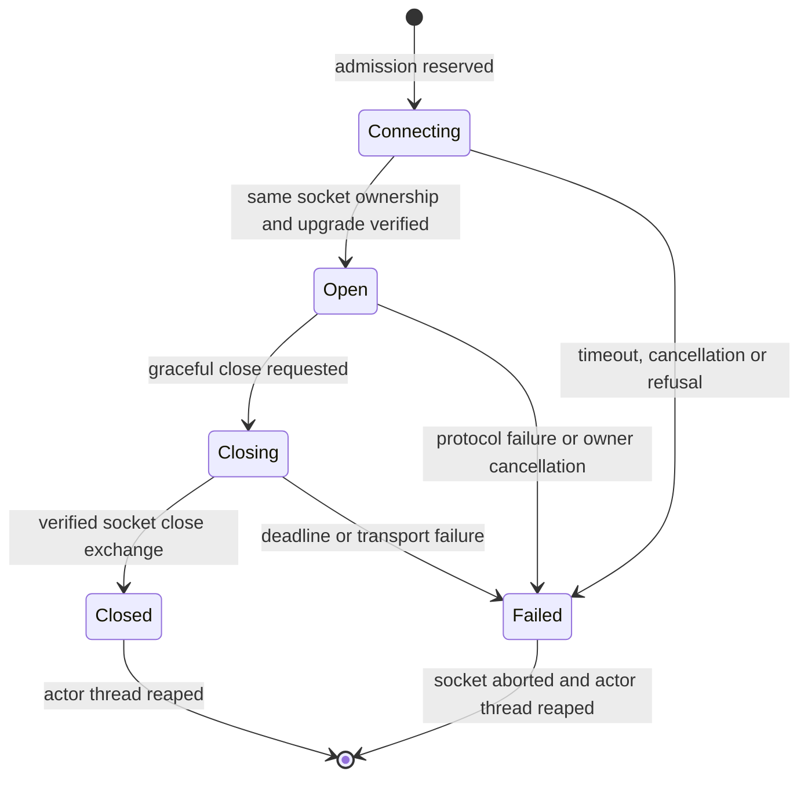

# Native owned socket actor: Rust design input

Status: proposed design, 8 October 2026, against Project Ned checkpoint `dfb63a7` and pinned Hermes `649d6c0391029f35959cfbc240eb3534a6667cf5`. No implementation, dependency changes, application/backend/model launches or worktree edits were performed for this design. Existing owned-ws remains a finite diagnostic transport. Numeric limits below are proposed initial qualification limits, not proven production capacity.

The companion [retained client design](CLIENT-DESIGN.md) defines the renderer and startup contracts. [Inspected source identities](SOCKET-ACTOR-SOURCE-RECEIPT.json) identify this proposal's inputs; they are not an implementation or transformation receipt.

## Decision

Use one dedicated native actor thread per admitted socket, owning one **nonblocking, already ownership-verified `TcpStream`** and one `tungstenite::WebSocket`. Keep all parser, send, flush and close calls on that thread. Use the existing Hermes log-safe revision 1 of Tungstenite 0.30.0 as the starting point. Do not put a permanently blocking socket read in Tauri's blocking pool, split the socket between concurrent readers/writers, or hold its mutex while waiting for inbound traffic.

Use a bounded command queue, a bounded event queue and an out-of-band atomic cancellation flag plus wakeup. An idle socket is allowed to remain idle. Only admitted connection/upgrade work, outstanding writes, incomplete input processing, close and owner cleanup have finite operation deadlines. The unchanged shared TypeScript channel continues to own JSON-RPC heartbeat and reconnect semantics.

A separate, reviewed vendor revision exposing parser progress is a prerequisite. Neither `read()` return values nor a timeout around an async `next()` future reveal enough information to correctly time partial frames and fragmented messages. Do not promote the diagnostic API merely by changing its timeout or treating every `WouldBlock` as a fresh operation.

## Existing versions and source anchors

Repository paths in this document are relative to the managed Project Ned root. Local dependency sources inspected are under `C:/Users/Ghols/.cargo/registry/src/index.crates.io-1949cf8c6b5b557f/`. Upstream Hermes files were read from `G:/Personal_Assistant/hermes/hermes-agent`; pinned links below identify their portable source identity.

| Existing seam | Observed source and consequence |
| --- | --- |
| Tauri 2.12.1; tauri-runtime 2.12.1; tauri-runtime-wry 2.12.1; Wry 0.57.0 | `hermes-native/apps/desktop-shell/Cargo.toml:16` and its lockfile. Preserve existing shell pins. |
| Tokio 1.53.2, tokio-util 0.7.19, mio 1.2.4 | Resolved in the same shell lockfile; Tokio begins at line 3391. Being transitive does not make a crate a directly usable dependency. |
| Tauri Tokio integration | Cached `tauri-2.12.1/src/async_runtime.rs:5-19` documents the singleton and reexports bounded `mpsc::channel`; cached `Cargo.toml:240-248` enables rt, rt-multi-thread, sync, fs and io-util. Do not infer a net/time feature contract from unrelated transitive consumers. |
| Existing WebSocket pin | `hermes-native/services/owned-ws/Cargo.toml:11`: local exact `tungstenite = 0.30.0`, defaults off, handshake only, vendor revision `hermes-logsafe-1`. No tokio-tungstenite entry was found in the shell lockfile or local cached package inventory. |
| Ownership before credentials | `services/owned-ws/src/lib.rs:64-112` and `services/owned-http/src/{lib.rs,ownership.rs}`: connected tuple observation, query-only process handle, private Job check, then request construction and upgrade on that stream. |
| Current blocking limitation | `services/owned-ws/src/lib.rs:137-165` and `src/stream.rs:43-116`: read has one fatal operation deadline and exclusive mutable socket access. |
| Tungstenite nonblocking state | Vendored `src/handshake/mod.rs:29-48` retains `MidHandshake` on `Interrupted`; `src/protocol/mod.rs:270-313` distinguishes queued writes from `WriteBufferFull` and allows retrying flush after `WouldBlock`. |
| Internal fairness / progress | Vendored `src/protocol/mod.rs:449-478` loops over fragments and automatic writes inside one read; `:370` holds private `incomplete`; `src/protocol/frame/mod.rs:106-119` holds private input buffer/header state. |
| Buffered partial output | Vendored `src/protocol/frame/mod.rs:250-287`: frames are buffered before write; successfully written prefixes are drained. Repeating the message after `WouldBlock` can duplicate it. |
| Exact native window / navigation | `apps/desktop-shell/src/catalog.rs:88-139` binds the exact main HWND and checks live state before admission/after work. `src/navigation.rs:13-26` permanently fences a second allowed document navigation, including one arriving before owner registration; `src/main.rs:208-259` wires the current policy. |
| Worker ownership | `services/resource-host/src/windows.rs:237-269` rejects observed PID checks after retirement; `:294-298` sets retirement_requested before waiting for retirement locks. `src/capture.rs:179-240` separates root/EOF from whole Job retirement. |

Official API references: [Tungstenite client_with_config 0.30.0](https://docs.rs/tungstenite/0.30.0/tungstenite/client/fn.client_with_config.html), [WebSocketConfig 0.30.0](https://docs.rs/tungstenite/0.30.0/tungstenite/protocol/struct.WebSocketConfig.html). The exact local source, not the moving latest documentation, controls this proposal.

## Why the nonblocking actor is the first candidate

The synchronous library already accepts the supplied verified stream, preserves interrupted handshake/parser/output state and has reviewed log sanitization. A dedicated thread with `std::sync` bounded state and a condition-variable wakeup can implement the initial Windows-only actor without another networking dependency. Poll an otherwise idle socket at no more than a proposed 10 ms interval; commands, cancellation and close signal the condition variable immediately. The initial tradeoff is bounded idle polling overhead, which must be measured. A later Windows readiness wait can replace polling after its wakeup/socket ownership semantics are tested.

An async design could wrap the same nonblocking standard stream using Tokio and feed it to a supplied-stream async WebSocket handshake. It must never use a URL connect helper. However, that requires an explicitly pinned compatible async adapter, its own feature/log audit, a direct Tokio dependency with reviewed net/time features, and preservation of this vendor patch rather than accidentally resolving a second upstream Tungstenite copy. It still needs parser progress and bounded queue/cancellation policies. It is therefore an alternative after measurement, not a shortcut around the current gate.

Do not use `TcpStream::try_clone` to give a reader and writer independent Tungstenite instances. WebSocket parsing, masking, automatic control replies, close state and partial output belong to one protocol state machine. An optional duplicate OS socket handle used **only** for out-of-band `shutdown(Both)` may later be considered; it must never read/write/reconnect and needs its own close-race proof. It is not required for the first nonblocking candidate.

## Minimal source seams for the future implementation

Add an opt-in actor module inside `services/owned-ws`, so both modes reuse the same exact ownership connector and upgrade policy. Keep the existing diagnostic API and tests compatible. Extract only shared fixed-request/response validation from `src/lib.rs`; introduce a separate nonblocking `PumpStream`, since `DeadlineStream` deliberately treats idle operation expiry as fatal. Keep application JSON-RPC and renderer handle policy outside the transport module. No resource-host change is needed for this design. Do not duplicate the credentials/response-header policy in a second client.

The progress accessor requires a new vendor revision and independent review: record whole-file input SHA-256, exact symbol/call-site preimages and occurrence counts for `FrameCodec::read_frame`, its buffer/offset advancement, `WebSocketContext::read_message_frame` and the fragmented-message state transitions. The current receipt attests log sanitization only; it cannot attest new progress instrumentation. Require exact reconstruction and tests proving unchanged wire/parser outcomes in addition to progress correctness. No source edits are part of this design delivery.

## Proposed ownership and API boundary

Host-owned state has immutable `backend_generation`, `profile_identity`, `window_identity` and `document_epoch`. Each connect attempt mints a different opaque `socket_generation`. No renderer-supplied PID, port, URL or token selects an endpoint. The host looks up a previously admitted backend descriptor and verifies its current live generation.

Conceptual API, not an implemented public contract:

```text
SocketRegistry::try_open(window_context, backend_handle) -> SocketHandle
SocketHandle::try_send(sequence, bounded_message) -> Accepted | Busy | Retired
SocketHandle::poll_events(last_ack, bounded_wait) -> bounded ordered batch
SocketHandle::request_close(code) -> close requested
SocketHandle::cancel(reason) -> synchronous admission fence + wakeup
SocketRegistry::retire_document(epoch) -> admission fence + async cleanup receipt
```

The initial application-wide and per-main-window cap is one admitted actor/connect attempt total and one configured backend generation. A reconnect cannot create a second thread until the old actor is terminal and reaped; an unreaped actor keeps its slot occupied, even after its delivery handle is invalidated. Retain at most 16 small closed-handle receipts/tombstones for at most 30 seconds or until acknowledged. Never reuse socket generations; absent/expired handles always reject, so dropping tombstones cannot reauthorize old handles. No reconnect history grows without a cap.

One actor owns an `Arc<WorkerGroup>` lease, but the backend supervisor also retains a separate reachable Arc before actor admission. Dropping the actor must not accidentally make it the only owner of the backend Job. The process supervisor retains `CapturedWorker` and the cleanup responsibility; the socket actor closes only its socket. Individual socket close/reconnect never terminates a backend that another admitted profile/tab/socket could share. Backend-wide retirement is exclusively the supervisor policy decision, even though the initial actor gate admits only one socket. Backend retirement first fences all its socket admissions, wakes/cancels them, and then performs finite owned-process cleanup. No socket operation opens an admission path after the Worker's permanent retirement flag is set. Move the Arc into the actor closure and create any borrowed protocol wrapper inside that closure; do not construct a self-referential owner/socket struct around the current `OwnedWebSocket<'a>`. A wedged actor retaining an Arc cannot substitute for explicitly reachable supervisor retirement.

The actor state is `Connecting -> Open -> Closing -> Closed`, with `Failed` terminal from any live state. Cancellation is monotonic. A registry record and its queue/byte reservations exist **before** a thread or future is launched. Reject floods synchronously with static errors before creating more tasks. Thread handles and completion receipts remain owned until reaped; a bounded wait expiring is an explicit unverified actor-exit outcome, never a fabricated cleanup success.




This is the proposed socket actor lifecycle. Backend Job retirement and process/pipe cleanup have their own receipts. A failed or delivery-invalidated actor continues to occupy its admission slot until it is actually reaped.

## Connect and upgrade

Keep the existing fixed local IPv4 endpoint, fixed `/api/ws` route, token alphabet/length cap and matching loopback Origin/Host rules. Start the total deadline at admission, proposed 5 seconds and hard cap 10 seconds, below the retained client's default 15-second connect timer. A later implementation may make the TCP connect cancellable with a Windows-native nonblocking connect, but the first design can use the existing bounded `connect_owned` on the actor thread. During that OS connect, cancellation fences delivery/admission immediately; thread completion may take the remaining connect budget. State this distinction explicitly.

After connecting, verify the exact established reversed tuple and its server PID membership in the current private Job before constructing any credential-bearing request. Switch **that same stream** to nonblocking mode. A handshake interrupted by `WouldBlock` retains its `MidHandshake`; resume it under the original total deadline. Never recreate the request or reconnect as a retry. Keep the current header cap, 32-header limit, exactly-one critical response-header checks and rejection of redirects/extensions/subprotocols. Transfer any coalesced first WebSocket bytes and their receive timing into the open actor.

The stream wrapper checks cancellation and current owner membership before every underlying read/write/flush and around the ownership/handshake phase. Kernel ownership queries are synchronous bounded-work calls, not hard realtime cancellable operations. Recheck document/backend/socket generation before publishing `open`. Successful HTTP101 is transport open, not `gateway.ready`, negotiated capability readiness or completed startup RPCs.

## Finite fair pump

A proposed turn processes cancellation and expired deadlines first, then pending control/output flush, at most 8 admitted outgoing messages and at most 16 returned incoming messages. The stream wrapper permits at most 16 actual socket calls or 64 KiB of newly transferred wire data per turn, whichever comes first, and yields synthetic `WouldBlock` once exhausted. Never return `Ok(0)` for quota exhaustion, because that signals EOF. It uses actual nonblocking I/O, not per-call blocking timeouts. The turn's receive and transmit quotas cannot reset inside Tungstenite's internal fragment/control loop.

Tungstenite can process already-buffered fragments without another stream call. The configured 4096-byte read size limits each acquisition, not all parser storage: `FrameCodec::read_frame` reserves the advertised payload (`frame/mod.rs:191`) and can retain up to the 256 KiB frame cap, while `context.incomplete` can hold up to the 1 MiB message cap. Account for both existing buffers, coalesced tail and up to 64 KiB new wire bytes, including final UTF-8 validation/copies, when bounding turn work and memory. A stream-call quota cannot preempt parsing/copying bytes already in those buffers. Parser-progress frame counters additionally enforce a proposed 4096 incoming frames per one-second window and 4096 frames per assembled data message. Flood overflow closes with a static resource-limit reason. Before implementation, measure worst-case zero-length fragments and automatic control flushes under this exact bound. If the work ceiling does not meet the measured responsiveness target, a reviewed per-frame yield hook is required; a syscall quota alone is not a hard CPU-time preemption guarantee.

After every protocol call and before publishing a message, send-flushed receipt, open or close success, recheck cancellation, generation and the applicable original deadline. Check any expiring assembly timer before clearing it on successful completion; a late completed frame does not erase a timeout.

When no work progresses, wait on a condition variable until the earliest queued-command signal, cancellation, deadline or 10 ms poll tick. Use a predicate/counter under the queue lock so a signal between check and wait cannot be lost. Never hold the registry, queue, WorkerGroup or native-window lock while parsing, performing OS I/O, serializing/delivering events or waiting. Proposed cancellation and queued-send response target: within 50 ms under tested CPU load after a successful connect; OS calls are an explicit practical limitation.

## Partial input: required parser-progress revision

A bare `in_buffer.len() > 0` test is insufficient: buffered bytes may contain a complete next frame, a partial next header or payload. `Ping`/`Pong` can be returned while `WebSocketContext.incomplete` retains a fragmented data message. Clearing a timer on any returned event or resetting it on each new byte allows an endless drip/control interleave to keep incomplete data forever. A timeout around a single `read()`/`next()` call makes healthy idle time look like message assembly.

Propose a new, separately identified vendor revision with an observational API returning numeric facts only:

```text
InputProgress {
    buffered_wire_start, buffered_wire_end,
    pending_frame_start: Option<WireOffset>,
    fragmented_data_start: Option<WireOffset>,
    completed_frame_count,
    fragmented_data_frame_count
}
```

Offsets are monotonic WebSocket wire offsets, maintained where the existing parser advances headers/payloads, not derived by a second RFC parser. `pending_frame_start` covers an incomplete header or parsed-header/payload, including a zero-byte payload header still awaiting completion. `fragmented_data_start` identifies the first data frame and remains identical across continuation/control frames until completion/error. Buffered unparsed tail is visible independently. Offset overflow terminates explicitly. No payload, key or URL appears in the snapshot or logs. This is a proposed instrumentation contract requiring code review and tests; it does not exist in revision 1. A flags-only accessor is not sufficient for unambiguous coalesced-message timing.

The actor's stream wrapper records bounded receive ranges `(wire_start, wire_end, first_received_at)` for bytes still relevant to parser progress. It retains the first timestamp of the active fragmented message separately and discards consumed ranges only after consulting the snapshot. Cap the ledger at 4096 ranges; resource exhaustion is a specific failure, not silently forgotten timing. Never read weights, parse JSON-RPC payloads or implement frame syntax in this ledger.

Use the earliest received timestamp covering each pending frame/fragment start. Seed the ledger for the handshake's preserved tail; otherwise an HTTP response coalesced with a slow first frame evades timing. After a complete message, consult the snapshot before retiring timing state: complete A plus partial B must start B from B's already-received bytes, not from the next read call. Interleaved Ping/Pong cannot reset the fragmented data timestamp. Proposed partial frame deadline 5 seconds; fragmented data/processing deadline 15 seconds, absolute from first relevant bytes. A buffered complete next frame is subject to a processing deadline too; call this **bounded input assembly/processing**, not exact measurement of remote network stalling.

If the proposed offsets/timestamp mapping proves too intrusive, the gate remains closed until an equivalent upstream/public progress hook is qualified. Do not ship a heuristic deadline that loses these distinctions. Switching to an async adapter does not remove this requirement.

## Queue, message and delivery limits

Proposed per-socket initial limits:

| Resource | Admission/bound |
| --- | --- |
| Owned actors | 1 globally and per main window, including connect/cleanup; replacement only after old actor is terminal/reaped; at most 16 small closed receipts for 30s |
| Message / incoming frame | 1 MiB complete message; 256 KiB incoming frame; outgoing frame may be one full 1 MiB message |
| Outbound application queue | 64 messages and 4 MiB payload bytes, both enforced; one accepted in-progress write remains charged |
| Inbound application queue | 128 messages and 8 MiB payload bytes; overflow closes, never silently drops deltas or coalesces message boundaries |
| Protocol output | Existing finite Tungstenite max write buffer, proposed message cap +4096 control overhead; automatic Pong/Close included |
| Terminal/control delivery | Reserved finite slots, independent of full data queue, so close/error cannot wait behind unbounded data |
| Renderer delivery | One pending poll and one unacknowledged batch per socket/document; initially one message per batch, max 1 MiB raw and a separately enforced serialized envelope cap (6 MiB+4096 for worst-case JSON escaping) |
| Data admission lifetime | Queued or flushing application message expires 5 seconds after native admission; no indefinite queue wait |

These limits intentionally constrain the first session-RPC candidate. History, replay, attachments and high-rate deltas need measured qualification and an explicit revised cap before broader parity claims. Retained `session.history` is unpaged, `session.resume` can contain messages/open requests, and the shared replay hold can accumulate live events while awaiting replay; native delivery credits do not automatically bound those retained client structures. These are additional measured compatibility gates, not justification for silent truncation. Native and adapter queues must both count bytes and entries. These admitted-queue limits do **not** bound Tauri/WebView IPC argument allocation before a native command handler runs. Prefer a finite byte-envelope check before typed payload decoding; inspect the Tauri/Wry IPC ingress before claiming an end-to-end allocation cap. A compromised renderer flooding oversized invocations remains an explicit boundary limitation unless that ingress cap is established; a handler check alone does not prove it. Tauri's event/Channel dispatch is not assumed to provide backpressure. Prefer a bounded pull/ack bridge: release event storage only after the same document acknowledges the monotonic event sequence; a stalled document exhausts finite credit and closes rather than accumulating hidden WebView messages.

The native 8 MiB inbound budget includes raw payload retained in the one unacknowledged batch, not only items still in the queue. Move that payload without cloning it; one separately capped serialized response buffer may consume up to 6 MiB+4096. Count any unavoidable native serialization/IPC copies during qualification. One response may still occupy framework/WebView transport storage, and JavaScript strings may require UTF-16 storage; these copies are not magically covered by the raw-byte limit. There must be no second pending native delivery/eval or receipt body until the first batch is acknowledged or the generation fails. The adapter acknowledges only after dispatching a sequence once; authenticated monotonic sequence validation prevents duplicate delivery on an uncertain poll response. Retained application callbacks/history/replay structures can keep their own references afterward and need their separate bounds. Thus the proposal bounds the actor-owned queue and admitted delivery slots, not total process memory across Tauri internals or all client state.

`WebSocketLike.send()` is synchronous while native IPC is asynchronous. The small adapter therefore needs its own synchronous admission cap and ordered one-in-flight native enqueue operation. It can throw immediately for closed/local-oversize/local-cap failures; a later native refusal yields an ordered error/close event and rejects that generation's pending calls. It cannot pretend that enqueue acceptance proves network delivery or execution. This semantic difference must be qualified against the retained client, including request send exceptions, rather than hiding it in an unbounded Promise queue.

## Partial writes, close and replay

Call Tungstenite `write(message)` once per admitted application message. Success or `Io(WouldBlock)` may mean accepted/partially written; retain the reservation and drive `flush()` until it succeeds or the original admission deadline expires. Never submit the same message again after `WouldBlock`. `WriteBufferFull(returned_message)` is the distinct unaccepted case: retain at most the already-reserved item for a later attempt, or fail it with an explicit capacity outcome. Other I/O/protocol errors are fatal. Neither successful flush nor a transport receipt establishes RPC execution.

Graceful close atomically stops new sends, finishes only already accepted finite output under one proposed 2-second deadline (hard cap 5s), queues exactly one Close and drives read/flush until peer close plus underlying closure. Do not manually duplicate automatic Pong replies. A blocked application write may consume the close budget; timeout aborts the socket and labels completion forced/unverified. On cancellation caused by navigation, destroy or backend retirement, prefer immediate abort and generation invalidation; do not keep the old document alive solely to drain application messages. Socket closure is separate from Job/root/EOF cleanup.

The actor does not reconnect or replay messages. The retained gateway owner decides whether to open a new socket generation; the host revalidates the current backend before every attempt and limits admission/backoff. No uncertain `prompt.submit` is resent. Preserve shared request/replay epochs and session event sequence behavior. For backend replacement, mint a new backend generation and credential, retire the old Job with its own receipt, and never attach an old descriptor to the new process.

## Heartbeat and document lifecycle

The retained [channel constants and contract](https://github.com/NousResearch/hermes-agent/blob/649d6c0391029f35959cfbc240eb3534a6667cf5/apps/shared/src/json-rpc-channel.ts#L128) specify JSON-RPC `gateway.ping` every 15s and a 45s liveness deadline. [startHeartbeat](https://github.com/NousResearch/hermes-agent/blob/649d6c0391029f35959cfbc240eb3534a6667cf5/apps/shared/src/json-rpc-channel.ts#L521) starts only when advertised; [desktop gateway construction](https://github.com/NousResearch/hermes-agent/blob/649d6c0391029f35959cfbc240eb3534a6667cf5/apps/shared/src/json-rpc-gateway.ts#L180) uses `any-inbound`, while response-only mode is a separate channel option. The retained [server dispatch](https://github.com/NousResearch/hermes-agent/blob/649d6c0391029f35959cfbc240eb3534a6667cf5/tui_gateway/ws.py#L420) answers that request. Wire Ping/Pong tests do not qualify this heartbeat. Retained `ws.py:195` sends each JSON object as its own text message, and the channel parses each message once. Never join notifications with raw LF or turn coalesced socket bytes into a JSON array; coalescing is a TCP/parser concern, not a replacement message format.

Do not generate a second Rust JSON-RPC heartbeat or parse application messages to special-case it. Fair native sending and finite ordinary queues let the unchanged channel transmit its request promptly. If backpressure prevents that, close truthfully. With no partial input/write/close deadline active, the transport has no 15s idle expiry. Test several 45s windows with real channel heartbeat, delayed replies and notifications. Hidden/minimized WebView timer throttling, machine sleep/wake and event-delivery delay remain explicit platform qualification tests; the actor must not manufacture liveness for a suspended shared channel.

Bind native socket records to exact main window identity and a **native-maintained document epoch**, not merely a renderer `documentId`. The existing injected UUID is a delivery correlation tag, not an authorization token. On allowed full navigation, invalidate the old epoch and socket handles synchronously before the callback returns. Unknown/remote navigation remains denied. On Destroyed, invalidate window ownership before starting finite cleanup off the UI thread. Recheck backend/window/document/socket generations immediately before every event delivery and command execution; queued old-document work cannot be redirected into the new page. Suppress late open/message/success after invalidation and deliver at most one terminal close to a still-valid document.

The current preview navigation fence permanently retires after reload. First actor integration should preserve that conservative policy unless a separate host-controlled new-document/bootstrap handshake is implemented and tested. Do not infer that a replacement page with the same URL or renderer UUID inherits a live socket. Same-document router navigation needs separate identification from full document reload; verify Tauri/WebView callback behavior in the native fixture.

## Required acceptance before any backend/UI claim

1. Deterministic parser-progress tests: incomplete header/payload, first fragment plus interleaved Ping/Pong, complete A plus partial B in one receive, multiple complete messages plus tail, handshake tail, ledger cap and counter overflow. Verify fixed timestamps/deadlines are never extended by progress/control traffic.
2. Nonblocking semantics: real tiny writes that repeatedly return WouldBlock, exactly-once message bytes after flush, WriteBufferFull retaining only unaccepted item, queued output during idle read, automatic control output under full buffers, half-close, malformed close and close timeout. Retain existing ownership/zero-byte-outsider/canary tests.
3. Fairness/backpressure: permanently readable zero-length fragments and control floods while enqueueing RPC/cancel; blocked peer writes; queue byte and entry saturation; event consumer stalled; one-in-flight IPC flooding; admission before task creation. Measure response latency and maximum retained memory, not only final outcomes.
4. Generation/lifecycle: cancellation before TCP connection completes, during ownership query/handshake, after HTTP101 before open delivery, during partial read/write, full reload, Destroyed, backend crash and reconnect. Assert no old event or uncertain send crosses a generation; verify separate actual root exit, both EOF and bounded Job-empty accounting.
5. Retained-client fixtures: exact open/message/error/close ordering and readyState, whole text/binary message boundaries, embedded newlines inside payload strings and several distinct JSON-RPC messages coalesced in one TCP read, listener disposal, request send failure, gateway.ready negotiation,15s/45s real heartbeat and reconnect replay. Run all existing 19 shared gateway tests plus new actor/native integration tests.
6. Dependency/provenance: separate vendor revision receipt, exact reviewed progress instrumentation diff, archive/input/output hashes, log-canary test, LF protections and Foundation verification. No parser rewrite, global logging filter or unresolved second Tungstenite copy.

The first implementation gate is the parser-progress API plus a tiny standalone nonblocking actor harness. Only after those tests pass should it acquire renderer bindings or real retained gateway handlers. No current receipt proves that API, actor scheduling, hidden-window heartbeat, end-to-end queue bounds or live Hermes startup.
